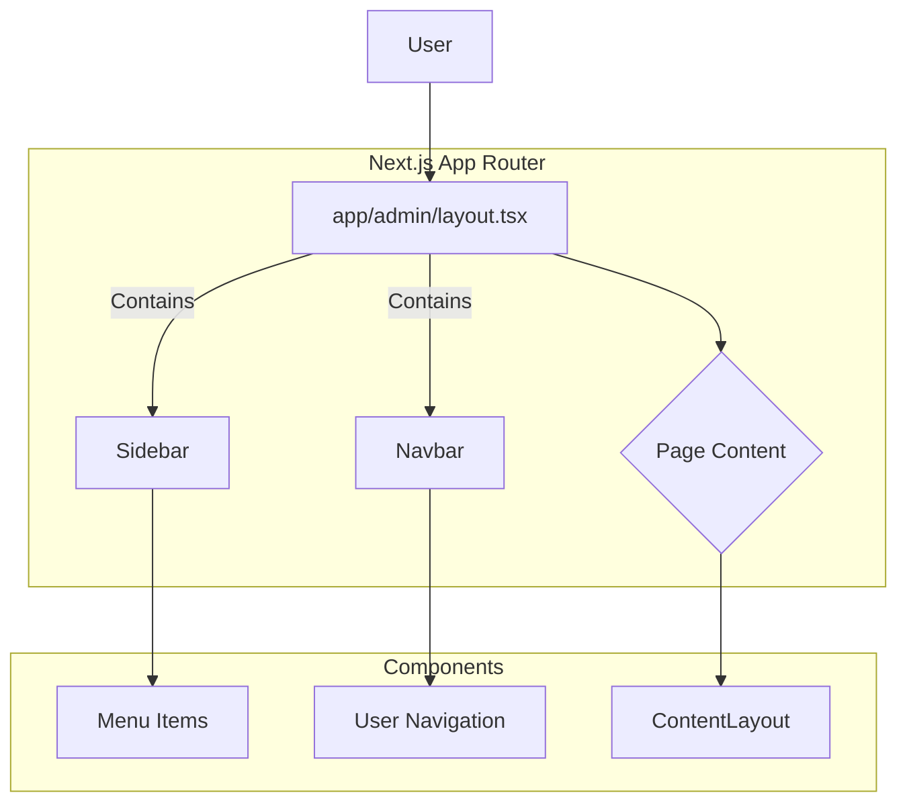

````markdown
---
phase: design
title: Thiết Kế Hệ Thống & Kiến Trúc
description: Xác định kiến trúc kỹ thuật, các thành phần và mô hình dữ liệu
---

# Thiết Kế Hệ Thống & Kiến Trúc - Nền tảng Dashboard Admin

## Tổng Quan Kiến Trúc

**Cấu trúc hệ thống cấp cao là gì?**

Kiến trúc hoàn toàn nằm ở phía Frontend (Next.js). Chúng ta sẽ tạo ra một cấu trúc layout lồng nhau (nested layout) sử dụng App Router của Next.js.

- **`app/admin/layout.tsx`**: Đây sẽ là layout gốc cho toàn bộ khu vực admin. Nó sẽ chứa `Sidebar` và `Navbar` cố định.
- **`app/admin/**/page.tsx`**: Các trang con bên trong admin (ví dụ: `app/admin/dashboard/page.tsx`) sẽ được render vào bên trong layout gốc này.



- **Stack công nghệ:** Next.js (App Router), TypeScript, Tailwind CSS, Shadcn/UI, Lucide Icons.

## Mô Hình Dữ Liệu

Không có thay đổi về mô hình dữ liệu ở backend. Phía frontend sẽ cần một interface để định nghĩa cấu trúc của một mục menu trong sidebar.

```typescript
// Proposed interface for a navigation link
interface NavLink {
  href: string;
  label: string;
  icon: React.ElementType; // e.g., Lucide Icon
  roles?: ("admin" | "receptionist" | "technician")[]; // Optional roles that can see this link
}
```

## Thiết Kế API

Không yêu cầu API mới. Layout sẽ sử dụng các API hiện có để:

1.  Lấy thông tin người dùng hiện tại (`/api/v1/users/me`) để hiển thị trên `Navbar`.
2.  Xác định vai trò của người dùng để hiển thị các mục menu phù hợp.

## Phân Tích Thành Phần

Dựa trên các file tham khảo trong `#file:admin-panel`, chúng ta sẽ tạo/điều chỉnh các components sau:

- **`components/admin/AdminPanelLayout.tsx`**: Component chính, tổng hợp `Sidebar`, `Navbar` và nội dung trang. Quản lý trạng thái đóng/mở của sidebar.
- **`components/admin/Sidebar.tsx`**: Thanh điều hướng bên cạnh. Chứa `Menu` và `CollapseMenuButton`.
- **`components/admin/Navbar.tsx`**: Thanh điều hướng trên cùng. Chứa `SheetMenu` (mobile), `UserNav`.
- **`components/admin/ContentLayout.tsx`**: Wrapper cho nội dung chính của trang, cung cấp tiêu đề và padding nhất quán.
- **`components/admin/Menu.tsx`**: Render danh sách các `NavLink` trong `Sidebar`.
- **`components/admin/UserNav.tsx`**: Dropdown menu cho người dùng, chứa link tới trang cá nhân và nút đăng xuất.
- **`components/admin/SheetMenu.tsx`**: Phiên bản mobile của menu, hiển thị trong một `Sheet` của Shadcn/UI.
- **`app/admin/layout.tsx`**: Layout của Next.js, sử dụng `AdminPanelLayout` để bao bọc các trang con.
- **`app/admin/dashboard/page.tsx`**: Trang ví dụ để kiểm tra giao diện layout.

## Quyết Định Thiết Kế

- **Sử dụng Next.js App Router Layouts:** Tận dụng tính năng layout của Next.js để có kiến trúc lồng nhau hiệu quả, tránh re-render các thành phần chung như Sidebar, Navbar khi chuyển trang.
- **Component-based:** Chia nhỏ giao diện thành các components độc lập, có thể tái sử dụng theo cấu trúc đã phân tích.
- **Responsive-first:** Thiết kế ưu tiên cho di động, sử dụng `SheetMenu` và ẩn sidebar trên màn hình nhỏ.
- **Cấu hình Menu tập trung:** Danh sách các mục menu sẽ được định nghĩa trong một file cấu hình riêng (ví dụ: `config/menu.ts`) để dễ dàng quản lý và phân quyền theo vai trò.

## Yêu Cầu Phi Chức Năng

- **Hiệu suất:** Layout cần được tải nhanh. Tận dụng Server Components của Next.js để render các thành phần tĩnh.
- **Bảo mật:** Các mục menu cần được ẩn/hiện dựa trên vai trò của người dùng được lấy từ API, không chỉ ẩn trên UI.
````
