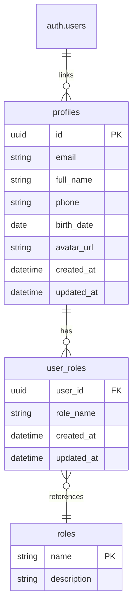
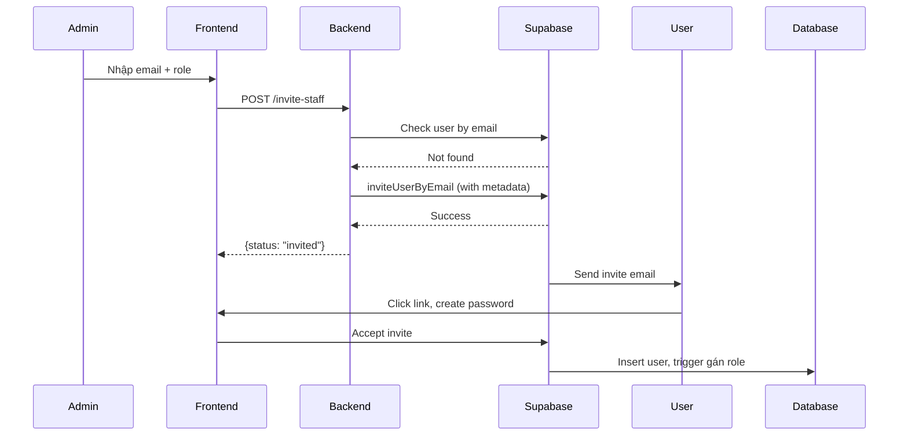
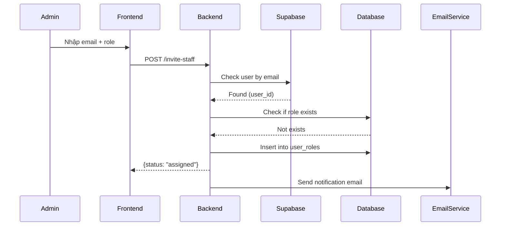
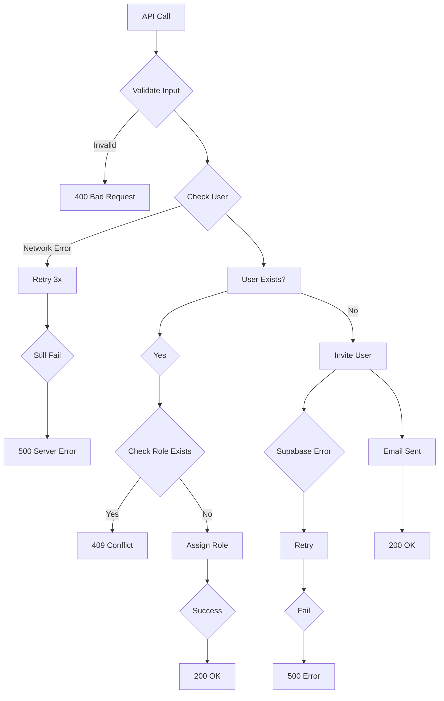

# Thiết Kế Hệ Thống & Kiến Trúc

## Tổng Quan Kiến Trúc

**Cấu trúc hệ thống cấp cao là gì?**

- Bao gồm sơ đồ mermaid nắm bắt các thành phần chính và mối quan hệ của chúng.
  ```mermaid
  graph TD
    Admin[Admin User] -->|JWT| Frontend[Next.js Frontend]
    Frontend -->|API Call| Backend[FastAPI Backend]
    Backend -->|Check User| Supabase[Supabase Auth]
    Backend -->|Invite New| Supabase
    Backend -->|Update Roles| Database[(PostgreSQL)]
    Supabase -->|Send Email| User[Staff User]
    User -->|Accept Invite| Frontend
    Database -->|User Roles| Backend
  ```
- Các thành phần chính: Frontend (Next.js) cho giao diện Admin, Backend (FastAPI) xử lý logic mời/gán, Supabase quản lý Auth và gửi email, PostgreSQL lưu vai trò.
- Lựa chọn stack: Tuân thủ quy tắc dự án (FastAPI, Supabase, Next.js).

## Mô Hình Dữ Liệu

**Chúng ta cần quản lý dữ liệu nào?**

- Thực thể: User (liên kết với auth.users), Role (enum: customer, technician, receptionist, admin), UserRoleLink (bảng liên kết user_id và role_name).
- Schema UserRoleLink: 
  - user_id: UUID (FK đến User.id / auth.users.id)
  - role_name: str (enum: customer, technician, receptionist, admin)
  - created_at: datetime
  - updated_at: datetime
  - Constraints: Primary key (user_id, role_name), FK user_id references profiles(id) hoặc auth.users(id)
- Luồng dữ liệu: Admin gửi request → Backend validate → Supabase check user → DB update hoặc Supabase invite → Email → User response.

### DB Schema Diagram


## Thiết Kế API

**Các thành phần giao tiếp như thế nào?**

- API nội bộ: POST /api/v1/admin/invite-staff với body {email: string, role: string (enum)}.
- Phản hồi: 
  - Success (200): {message: "Đã gửi lời mời đến email", status: "invited"}
  - Assign (200): {message: "Đã gán vai trò receptionist cho user", status: "assigned"}
  - Error (400): {detail: "Email không hợp lệ"}
  - Error (409): {detail: "User đã có vai trò này"}
  - Error (500): {detail: "Lỗi server"}
- Xác thực: JWT Admin, kiểm tra role "admin" từ DB.

## Phân Tích Thành Phần

**Các khối xây dựng chính là gì?**

- Frontend: Component InviteStaffForm, API request inviteStaff.
- Backend: Module admin (schemas, service, routes), tích hợp với existing auth/database.
- Database: Bảng UserRoleLink, trigger cho việc gán vai trò sau invite.

### Sequence Diagram: Invite New User


### Sequence Diagram: Assign Role to Existing User


## Quyết Định Thiết Kế

**Tại sao chúng ta chọn cách tiếp cận này?**

- Sử dụng Supabase invite để tận dụng built-in email sending.
- Bảng liên kết cho vai trò nhiều-nhiều thay vì cột đơn để linh hoạt.
- Xử lý logic ở backend để đảm bảo bảo mật và nhất quán.

### Migration Plan từ Profile.role sang UserRoleLink
- Bước 1: Tạo bảng user_roles và roles (enum table).
- Bước 2: Migrate data: For each profile, insert into user_roles (user_id, role_name from profile.role).
- Bước 3: Remove column role from profiles (hoặc keep for backward compatibility).
- Bước 4: Update queries to use user_roles instead of profile.role.
- Rủi ro: Data loss if migration fails – backup DB trước.

### Integration với Existing Auth
- Cập nhật get_current_user để query user_roles và include list roles.
- Ví dụ: current_user = {id, email, roles: ["admin", "technician"]}.
- Sử dụng trong routes: if "admin" not in current_user["roles"].

## Quyết Định Thiết Kế

**Tại sao chúng ta chọn cách tiếp cận này?**

- Sử dụng Supabase invite để tận dụng built-in email sending.
- Bảng liên kết cho vai trò nhiều-nhiều thay vì cột đơn để linh hoạt.
- Xử lý logic ở backend để đảm bảo bảo mật và nhất quán.

### Migration Plan từ Profile.role sang UserRoleLink
- Bước 1: Tạo bảng user_roles và roles (enum table).
- Bước 2: Migrate data: For each profile, insert into user_roles (user_id, role_name from profile.role).
- Bước 3: Remove column role from profiles (hoặc keep for backward compatibility).
- Bước 4: Update queries to use user_roles instead of profile.role.
- Rủi ro: Data loss if migration fails – backup DB trước.

### Integration với Existing Auth
- Cập nhật get_current_user để query user_roles và include list roles.
- Ví dụ: current_user = {id, email, roles: ["admin", "technician"]}.
- Sử dụng trong routes: if "admin" not in current_user["roles"].

### Error Handling Chi Tiết
- Network failures: Retry Supabase calls (3 attempts), fallback to manual invite.
- Invalid emails: Validate format client-side và server-side.
- Supabase errors: Map to HTTP codes (e.g., 429 rate limit).
- DB errors: Rollback transactions, log errors.
- Email failures: Queue for retry, notify admin.

### Error Flows Diagram


### Bảo Mật & Quyền Riêng Tư
- Xác thực: JWT từ Supabase, verify signature.
- Ủy quyền: Check roles từ DB, không hardcode.
- Bảo vệ dữ liệu: Sanitize inputs, không expose sensitive info in responses.
- Logging: Audit logs cho invite actions, không log passwords.

## Yêu Cầu Phi Chức Năng

**Hệ thống nên hoạt động như thế nào?**

- Hiệu suất: Response time < 2s cho API invite.
- Bảo mật: Chỉ Admin có quyền, validate input email và role.
- Độ tin cậy: Xử lý lỗi khi Supabase unavailable, rollback nếu cần.
