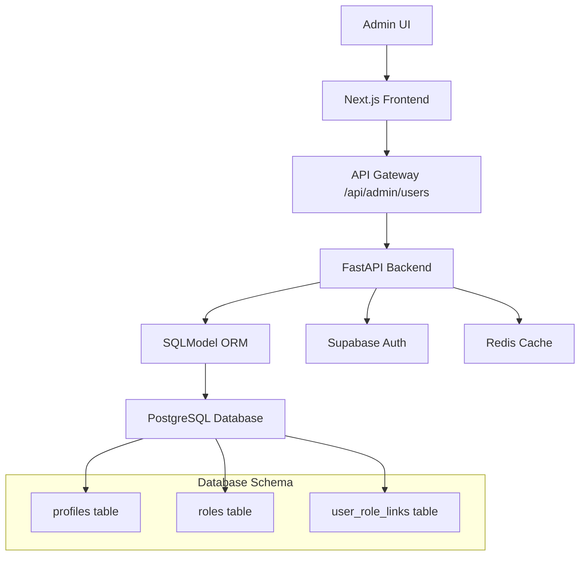

# Thiết Kế Kiến Trúc - Admin User Management

## Kiến Trúc Tổng Quan

**Kiến trúc hệ thống như thế nào?**



## Data Model & Schema

**Cấu trúc dữ liệu như thế nào?**

### User Profile Schema

```typescript
interface AdminUserProfile {
  id: string;
  email: string;
  full_name: string;
  phone: string | null;
  avatar_url: string | null;
  is_active: boolean;
  created_at: Date;
  updated_at: Date;
  roles: Role[];
  last_login: Date | null;
}

interface Role {
  id: string;
  name: string;
  description: string;
  permissions: string[];
}
```

### API Request/Response Schemas

```typescript
interface CreateUserRequest {
  email: string;
  full_name: string;
  phone?: string;
  roles: string[]; // role IDs
}

interface UpdateUserRequest {
  full_name?: string;
  phone?: string;
  is_active?: boolean;
  roles?: string[]; // role IDs
}
```

## API Design

**API endpoints như thế nào?**

### Endpoints

- `GET /api/admin/users` - List users with pagination/search
- `POST /api/admin/users` - Create new user
- `GET /api/admin/users/{user_id}` - Get user details
- `PUT /api/admin/users/{user_id}` - Update user
- `DELETE /api/admin/users/{user_id}` - Delete user (soft delete)
- `GET /api/admin/roles` - List available roles

### Authentication & Authorization

- JWT Bearer token required
- Custom claim `role: admin` required
- Rate limiting: 100 requests/minute

## UI/UX Design

**Giao diện người dùng như thế nào?**

### Main Components

- `AdminUserManagementPage` - Main page with table and actions
- `UserListTable` - Data table with sorting/filtering
- `UserCreateDialog` - Modal for creating new user
- `UserEditDialog` - Modal for editing user
- `RoleAssignmentDialog` - Modal for managing user roles

### Layout Structure

```
AdminUserManagementPage
├── Header (title, create button)
├── Filters (search, status, role filters)
├── UserListTable
│   ├── TableHeader (sortable columns)
│   ├── TableRows (user data)
│   └── Pagination
└── ActionDialogs (create, edit, roles)
```

### Responsive Design

- Desktop: Full table with all columns
- Tablet: Collapsible columns, modal dialogs
- Mobile: Card layout, bottom sheet dialogs

## Security Considerations

**Bảo mật được đảm bảo như thế nào?**

- Server-side validation cho tất cả inputs
- SQL injection protection qua SQLModel
- XSS protection qua React sanitization
- CSRF protection qua SameSite cookies
- Audit logging cho sensitive operations

## Performance & Scalability

**Hiệu suất và khả năng mở rộng?**

- Database indexing trên email, full_name, is_active
- Redis caching cho role data (TTL 1 hour)
- Pagination với limit 20 items/page
- Lazy loading cho role assignments
- CDN cho static assets

## Error Handling & Validation

**Xử lý lỗi và validation?**

- Client-side: Form validation với Zod schemas
- Server-side: Pydantic validation với custom error messages
- Error responses: Standardized JSON format
- User feedback: Toast notifications cho success/error

## Testing Strategy

**Chiến lược kiểm thử?**

- Unit tests: Service layer functions
- Integration tests: API endpoints
- E2E tests: Critical user flows
- Performance tests: Load testing với 1000 concurrent users
