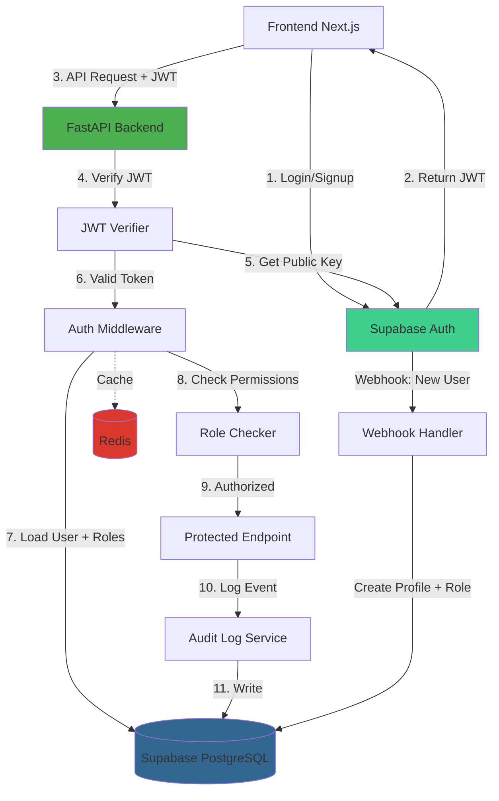
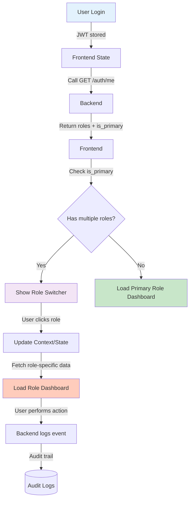
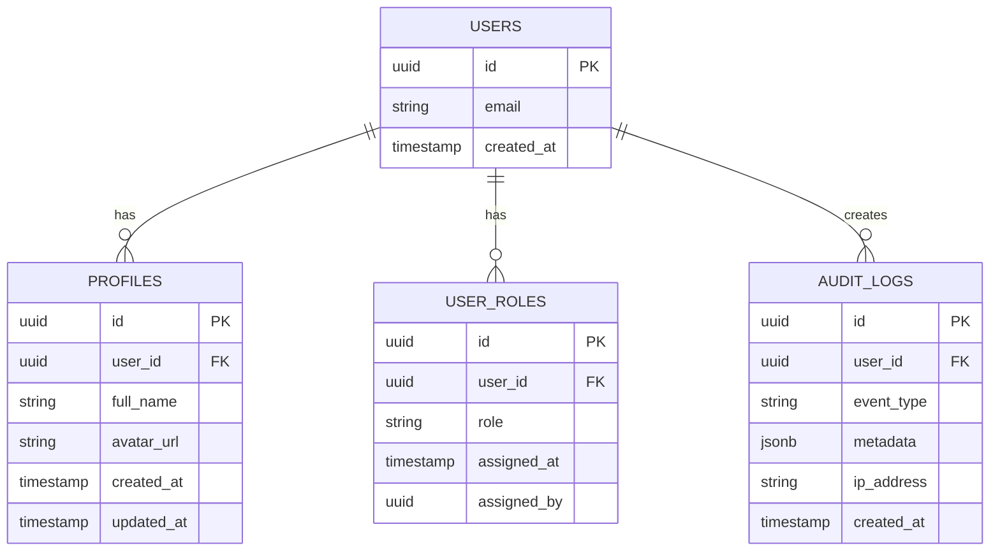

# Thiết Kế Hệ Thống & Kiến Trúc - Auth Backend Module

## Tổng Quan Kiến Trúc

**Cấu trúc hệ thống cấp cao:**



**Thành phần chính:**

| Thành phần            | Trách nhiệm                            | Công nghệ          |
| --------------------- | -------------------------------------- | ------------------ |
| **Supabase Auth**     | Đăng ký/đăng nhập, phát hành JWT       | Supabase (managed) |
| **JWT Verifier**      | Xác minh chữ ký JWT, extract payload   | PyJWT              |
| **Auth Middleware**   | Load user info, roles từ DB            | FastAPI Dependency |
| **Role Checker**      | Kiểm tra quyền truy cập endpoint       | FastAPI Dependency |
| **Audit Log Service** | Ghi log security events                | Custom service     |
| **Webhook Handler**   | Nhận event từ Supabase, tạo profile    | FastAPI endpoint   |
| **Redis Cache**       | Cache user info, roles để giảm DB load | Redis              |

**Lựa chọn stack công nghệ:**

- **PyJWT:** Verify JWT signature với Supabase public key (RSA256)
- **SQLModel Sync:** ORM cho profiles, user_roles, audit_logs
- **Redis:** Cache user data, TTL 15 phút
- **FastAPI Dependencies:** Dependency injection cho auth checks

## Multi-Role UI Flow (Frontend Integration)

**Role Switching Scenario:**



**Response structure từ `GET /api/v1/auth/me`:**

```json
{
  "user_id": "uuid",
  "email": "user@example.com",
  "roles": [
    {
      "role": "receptionist",
      "is_primary": true,
      "assigned_at": "2024-01-01T00:00:00Z"
    },
    {
      "role": "technician",
      "is_primary": false,
      "assigned_at": "2024-01-15T00:00:00Z"
    }
  ],
  "primary_role": "receptionist",
  "profile": {
    "full_name": "Nguyễn Văn A",
    "avatar_url": "https://..."
  },
  "created_at": "2024-01-01T00:00:00Z"
}
```

**Frontend state management (local state):**

```typescript
// useAuth.ts
interface UserState {
  user_id: string;
  email: string;
  roles: RoleInfo[];
  current_role: string;  // Currently selected role
  primary_role: string;  // Default role
  profile: Profile;
}

const useAuth = () => {
  const [user, setUser] = useState<UserState | null>(null);
  
  // Switch role
  const switchRole = (role: string) => {
    if (user?.roles.some(r => r.role === role)) {
      setUser({...user, current_role: role});
      // Fetch role-specific data
    }
  };
  
  return { user, switchRole };
};
```

## Mô Hình Dữ Liệu

**Các thực thể cốt lõi:**



### Schema Chi Tiết:

#### 1. `profiles` (Thông tin base user)

```sql
CREATE TABLE profiles (
    id UUID PRIMARY KEY DEFAULT gen_random_uuid(),
    user_id UUID NOT NULL REFERENCES auth.users(id) ON DELETE CASCADE,
    full_name VARCHAR(255),
    avatar_url TEXT,
    created_at TIMESTAMP WITH TIME ZONE DEFAULT NOW(),
    updated_at TIMESTAMP WITH TIME ZONE DEFAULT NOW(),
    UNIQUE(user_id)
);

CREATE INDEX idx_profiles_user_id ON profiles(user_id);
```

#### 2. `user_roles` (Multi-role mapping)

```sql
CREATE TABLE user_roles (
    id UUID PRIMARY KEY DEFAULT gen_random_uuid(),
    user_id UUID NOT NULL REFERENCES auth.users(id) ON DELETE CASCADE,
    role VARCHAR(50) NOT NULL CHECK (role IN ('customer', 'receptionist', 'technician', 'admin')),
    assigned_at TIMESTAMP WITH TIME ZONE DEFAULT NOW(),
    assigned_by UUID REFERENCES auth.users(id),
    is_primary BOOLEAN DEFAULT FALSE,
    UNIQUE(user_id, role)
);

CREATE INDEX idx_user_roles_user_id ON user_roles(user_id);
CREATE INDEX idx_user_roles_role ON user_roles(role);
CREATE INDEX idx_user_roles_primary ON user_roles(user_id) WHERE is_primary = TRUE;
```

#### 3. `audit_logs` (Security event tracking)

````sql
CREATE TABLE audit_logs (
    id UUID PRIMARY KEY DEFAULT gen_random_uuid(),
    user_id UUID REFERENCES auth.users(id) ON DELETE SET NULL,
    event_type VARCHAR(100) NOT NULL,
    metadata JSONB,
    ip_address INET,
    user_agent TEXT,
    created_at TIMESTAMP WITH TIME ZONE DEFAULT NOW()
);

CREATE INDEX idx_audit_logs_user_id ON audit_logs(user_id);
CREATE INDEX idx_audit_logs_event_type ON audit_logs(event_type);
CREATE INDEX idx_audit_logs_created_at ON audit_logs(created_at DESC);

**Audit Log Metadata Schema:**

Mỗi event type có metadata structure cụ thể:

```json
{
  "user.login": {
    "ip_address": "string",
    "user_agent": "string",
    "success": "boolean"
  },
  "user.logout": {
    "ip_address": "string"
  },
  "role.assigned": {
    "assigned_role": "string (customer|receptionist|technician|admin)",
    "assigned_by_id": "uuid",
    "reason": "string (optional)"
  },
  "role.revoked": {
    "revoked_role": "string",
    "revoked_by_id": "uuid",
    "reason": "string (optional)"
  },
  "appointment.checkin": {
    "appointment_id": "uuid",
    "customer_id": "uuid",
    "checked_in_by": "uuid",
    "timestamp": "timestamp"
  },
  "medical_note.created": {
    "appointment_id": "uuid",
    "customer_id": "uuid",
    "technician_id": "uuid"
  },
  "payment.processed": {
    "appointment_id": "uuid",
    "customer_id": "uuid",
    "amount": "decimal",
    "currency": "string (VND|...)",
    "processed_by": "uuid"
  },
  "payment.refunded": {
    "payment_id": "uuid",
    "refund_amount": "decimal",
    "refunded_by": "uuid",
    "reason": "string"
  }
}
````

```

**Luồng dữ liệu:**

1. User đăng ký → Supabase tạo record trong `auth.users`
2. Supabase webhook → Backend tạo `profiles` + `user_roles` (customer)
3. User login → Frontend lưu JWT
4. API request → Backend verify JWT → Load từ `user_roles`
5. Security event → Backend ghi vào `audit_logs`

## Thiết Kế API

### Auth Endpoints:

#### 1. `GET /api/v1/auth/me`

**Mô tả:** Lấy thông tin user hiện tại

**Headers:**

```

Authorization: Bearer <jwt_token>

````

**Response 200:**

```json
{
  "user_id": "uuid",
  "email": "user@example.com",
  "roles": ["customer", "staff"],
  "profile": {
    "full_name": "Nguyễn Văn A",
    "avatar_url": "https://..."
  },
  "created_at": "2024-01-01T00:00:00Z"
}
````

**Response 401:**

```json
{
  "error_code": "UNAUTHORIZED",
  "message": "Token không hợp lệ hoặc đã hết hạn"
}
```

#### 2. `POST /api/v1/auth/roles`

**Mô tả:** Admin gán role cho user (Admin only)

**Headers:**

```
Authorization: Bearer <admin_jwt>
```

**Request Body:**

```json
{
  "user_id": "uuid",
  "role": "staff"
}
```

**Response 201:**

```json
{
  "message": "Đã gán role staff cho user",
  "user_id": "uuid",
  "role": "staff",
  "assigned_at": "2024-01-01T00:00:00Z"
}
```

#### 3. `DELETE /api/v1/auth/roles/{user_id}/{role}`

**Mô tả:** Admin xóa role của user (Admin only)

**Response 200:**

```json
{
  "message": "Đã xóa role staff của user"
}
```

#### 4. `POST /api/v1/webhooks/auth/user-created` (Internal)

**Mô tả:** Supabase webhook khi user mới đăng ký

**Headers:**

```
X-Supabase-Signature: <signature>
```

**Request Body:**

```json
{
  "type": "INSERT",
  "table": "users",
  "record": {
    "id": "uuid",
    "email": "user@example.com"
  }
}
```

**Response 200:**

```json
{
  "message": "Đã tạo profile và gán role customer",
  "user_id": "uuid"
}
```

### Authentication/Authorization Pattern:

**Dependency Injection:**

```python
# Require authentication only
@router.get("/protected")
async def protected_route(current_user: CurrentUser = Depends(get_current_user)):
    return {"user_id": current_user.user_id}

# Require specific role
@router.get("/customer-only")
async def customer_route(current_user: CurrentUser = Depends(require_customer)):
    return {"message": "Customer area"}

# Require one of multiple roles
@router.get("/staff-or-admin")
async def staff_area(current_user: CurrentUser = Depends(require_roles(["staff", "admin"]))):
    return {"message": "Staff/Admin area"}
```

## Phân Tích Thành Phần

### Backend Components:

#### 1. `app/core/auth.py` (Core Auth Utilities)

**Chức năng:**

- `verify_jwt_token(token: str) -> dict`: Verify JWT với Supabase public key
- `get_current_user(token: str) -> CurrentUser`: Load user + roles từ DB
- `require_role(role: str) -> Callable`: Dependency factory cho role check
- `require_customer()`, `require_staff()`, `require_admin()`: Shortcuts

**Dependencies:**

- PyJWT cho JWT decode/verify
- Redis cho caching user info
- SQLModel Session cho DB queries

#### 2. `app/modules/auth/auth-models.py` (SQLModel Models)

**Models:**

- `Profile`: User profile info
- `UserRole`: Role assignments (multi-role support)
- `AuditLog`: Security event logs

**Quy tắc:**

- Dùng `field: type | None = None` (Python 3.13+)
- Foreign keys với `ON DELETE CASCADE`
- Indexes cho performance

#### 3. `app/modules/auth/auth-schemas.py` (Pydantic Schemas)

**Schemas:**

- `UserResponse`: Response cho `GET /auth/me`
- `AssignRoleRequest`: Request body cho assign role
- `AuditLogCreate`: Schema tạo audit log

#### 4. `app/modules/auth/auth-service.py` (Business Logic)

**Functions:**

- `create_user_profile(user_id, email)`: Tạo profile mới
- `assign_role(user_id, role, assigned_by)`: Gán role + log event
- `revoke_role(user_id, role, revoked_by)`: Xóa role + log event
- `log_audit_event(user_id, event_type, metadata, ip)`: Ghi audit log
- `get_user_roles(user_id)`: Lấy tất cả roles của user

#### 5. `app/modules/auth/auth-routes.py` (API Endpoints)

**Routes:**

- `GET /api/v1/auth/me`: Get current user
- `POST /api/v1/auth/roles`: Assign role (admin only)
- `DELETE /api/v1/auth/roles/{user_id}/{role}`: Revoke role (admin only)
- `POST /api/v1/webhooks/auth/user-created`: Webhook handler

#### 6. `app/modules/auth/webhook.py` (Webhook Handler)

**Chức năng:**

- Verify Supabase webhook signature
- Handle `user.created` event
- Idempotent processing (check if profile exists)

**Idempotency Implementation:**

```python
async def handle_user_created(event: WebhookEvent) -> dict:
    user_id = event.record['id']
    email = event.record['email']

    # 1. Check if profile already exists (idempotent)
    existing_profile = await db.query(Profile).filter(
        Profile.user_id == user_id
    ).first()

    if existing_profile:
        # Already processed, return success
        return {"status": "already_exists", "user_id": user_id}

    # 2. Create profile (atomic transaction)
    async with db.transaction():
        profile = Profile(
            user_id=user_id,
            full_name=None,  # Will be updated later from frontend
            avatar_url=None
        )
        await db.add(profile)

        # 3. Auto-assign customer role
        user_role = UserRole(
            user_id=user_id,
            role="customer",
            is_primary=True,  # First role is primary
            assigned_by=None  # System-assigned
        )
        await db.add(user_role)

    # 4. Log audit event
    await log_audit_event(
        user_id=user_id,
        event_type="user.created",
        metadata={
            "email": email,
            "auto_assigned_role": "customer"
        }
    )

    return {"status": "created", "user_id": user_id}
```

## Quyết Định Thiết Kế

### 1. Multi-Role vs Single-Role

**Quyết định:** Multi-role (1 user nhiều roles)

**Lý do:**

- ✅ Linh hoạt: User có thể vừa là customer vừa làm staff
- ✅ Scale tốt: Thêm role mới không cần migrate data
- ✅ Business logic phức tạp hơn nhưng đáng giá

**Tradeoff:**

- ❌ Query phức tạp hơn (JOIN user_roles)
- ❌ Cần cache để tránh N+1 queries

**Alignment với Requirements:**

- ✅ US-6: Multi-role support (1 user nhiều roles)
- ✅ US-7: Primary role (role đầu tiên là default)
- ✅ Frontend: Role switcher UI (requirement nhắc đến)

### 2. JWT Verification Strategy

**Quyết định:** Verify signature với Supabase public key

**Lý do:**

- ✅ Security: Không tin tưởng client blindly
- ✅ Standard: JWT best practice
- ✅ Supabase hỗ trợ JWKS endpoint

**Tradeoff:**

- ❌ Overhead: ~10ms per request (mitigate bằng cache)
- ❌ Network dependency: Cần fetch public key lần đầu

**Alignment với Requirements:**

- ✅ US-1: Verify JWT signature
- ✅ Constraint: Verify với Supabase public key (không self-signed)

### 3. Caching Strategy

**Quyết định:** Cache user info + roles trong Redis (TTL 15 phút)

**Lý do:**

- ✅ Performance: Giảm DB load từ N requests → 1 request per 15 phút
- ✅ Scalability: Redis có thể scale horizontal
- ✅ Graceful degradation: Fallback to DB nếu Redis down

**Tradeoff:**

- ❌ Eventual consistency: Role change delay tối đa 15 phút
- ❌ Complexity: Cần invalidate cache khi role change

**Alignment với Requirements:**

- ✅ Performance: Auth middleware < 50ms
- ✅ Cache decoded token để tránh verify lặp lại (US-1)

### 4. Audit Log Storage

**Quyết định:** Lưu trong PostgreSQL với partition strategy

**Lý do:**

- ✅ ACID: Đảm bảo consistency với role changes
- ✅ Query power: Dễ join với users, analytics
- ✅ Backup: Cùng backup strategy với main DB

**Tradeoff:**

- ❌ Storage: ~10.7 TB/year (need partition + archive)
- ❌ Maintenance: Cần cron job archive data cũ

**Alternative considered:**

- ❌ Separate logging service (Elasticsearch): Overkill cho MVP
- ❌ Cloud logging (CloudWatch): Vendor lock-in

**Alignment với Requirements:**

- ✅ US-5: Audit log cho security + business events
- ✅ Constraint: Lưu tối thiểu 1 năm (retention policy)
- ✅ Unified policy: Cùng TTL cho tất cả events

### 5. Webhook vs Database Trigger

**Quyết định:** Supabase webhook gọi backend endpoint

**Lý do:**

- ✅ Flexibility: Backend có thể xử lý logic phức tạp
- ✅ Testability: Dễ test webhook handler
- ✅ Observability: Log rõ ràng flow

**Tradeoff:**

- ❌ Network dependency: Webhook có thể fail
- ❌ Retry logic: Cần handle idempotency

**Alignment với Requirements:**

- ✅ US-4: Auto-assign role customer khi user mới
- ✅ Idempotent (không duplicate nếu gọi nhiều lần)

### 6. Primary Role Definition

**Quyết định:** `is_primary` flag trong `user_roles` table

**Lý do:**

- ✅ Explicit: Rõ ràng role nào là primary
- ✅ Flexible: Admin có thể thay đổi primary role
- ✅ Performance: Index trên `is_primary` để query nhanh

**Alternative considered:**

- ❌ Order in user_roles (order by created_at): Implicit, khó quản lý
- ❌ Dedicated column trong profiles: Cơ sở dữ liệu denormalized

**Alignment với Requirements:**

- ✅ US-7: Primary role (role đầu tiên được gán sẽ là default landing page)
- ✅ Multi-role user: Frontend role switcher + default landing page

## Permission Matrix (Phân Quyền Chi Tiết)

**Role Capabilities:**

| Chức Năng                | Customer | Receptionist | Technician       | Admin |
| ------------------------ | -------- | ------------ | ---------------- | ----- |
| **Appointment**          |          |              |                  |       |
| View own appointments    | ✅       | ✅           | ✅ (assigned)    | ✅    |
| Create appointment       | ✅       | ✅           | ❌               | ✅    |
| Update appointment       | ❌       | ✅           | ✅ (status only) | ✅    |
| Cancel appointment       | ✅ (own) | ✅           | ❌               | ✅    |
| Check-in/out customer    | ❌       | ✅           | ❌               | ✅    |
| **Medical Notes**        |          |              |                  |       |
| Create medical note      | ❌       | ❌           | ✅               | ✅    |
| Read medical notes       | ❌       | ❌           | ✅ (own)         | ✅    |
| Update medical note      | ❌       | ❌           | ✅               | ✅    |
| Delete medical note      | ❌       | ❌           | ❌               | ✅    |
| **Payment**              |          |              |                  |       |
| View own payment history | ✅       | ✅           | ❌               | ✅    |
| Process payment          | ❌       | ✅           | ❌               | ✅    |
| View payment reports     | ❌       | ❌           | ❌               | ✅    |
| Refund payment           | ❌       | ❌           | ❌               | ✅    |
| **User Management**      |          |              |                  |       |
| View own profile         | ✅       | ✅           | ✅               | ✅    |
| Edit own profile         | ✅       | ✅           | ✅               | ✅    |
| Assign roles             | ❌       | ❌           | ❌               | ✅    |
| Revoke roles             | ❌       | ❌           | ❌               | ✅    |
| **System**               |          |              |                  |       |
| View audit logs          | ❌       | ❌           | ❌               | ✅    |
| Configure services       | ❌       | ❌           | ❌               | ✅    |
| View system reports      | ❌       | ❌           | ❌               | ✅    |

**Chú thích:**

- ✅ Được phép
- ❌ Không được phép
- (Note): Điều kiện cụ thể

**Endpoint-Level Security:**

```python
# Example: Protected endpoint với role check
@router.get("/api/v1/appointments/{appointment_id}/medical-notes")
async def get_medical_notes(
    appointment_id: UUID,
    current_user: CurrentUser = Depends(require_roles(["technician", "admin"]))
):
    """Chỉ technician hoặc admin có quyền xem medical notes"""
    # Implementation
```

## Yêu Cầu Phi Chức Năng

### 1. JWT Public Key Management

**Supabase JWKS Endpoint:**

```
GET https://{SUPABASE_URL}/.well-known/jwks.json
```

**Caching Strategy:**

- Fetch public key một lần khi startup
- Cache trong memory (TTL: 1 giờ hoặc khi key rotation detected)
- On key miss, fallback to fetch từ JWKS endpoint
- Handle key rotation gracefully

**Implementation:**

```python
class JWKSManager:
    def __init__(self):
        self.public_keys = {}  # cache
        self.last_fetch = None
        self.ttl = 3600  # 1 hour

    async def get_public_key(self, kid: str) -> str:
        # Kiểm tra cache
        if kid in self.public_keys and not self.is_expired():
            return self.public_keys[kid]

        # Fetch từ JWKS endpoint
        keys = await self.fetch_jwks()
        self.public_keys = keys
        self.last_fetch = datetime.now()
        return self.public_keys.get(kid)
```

### 2. Caching Strategy

**User Info & Roles Caching:**

- Cache key: `auth:user:{user_id}:profile`
- Content: `{user_id, email, roles[], is_primary_role}`
- TTL: 15 phút
- Invalidate on: role assign/revoke

**Cache Invalidation:**

```python
# Khi assign/revoke role
async def assign_role(user_id: UUID, role: str, assigned_by: UUID):
    # 1. Update database
    user_role = await create_user_role(user_id, role)

    # 2. Invalidate cache ngay lập tức
    await redis.delete(f"auth:user:{user_id}:profile")

    # 3. Log audit event
    await log_audit_event("role.assigned", ...)
```

**Fallback to DB:**

```python
# Nếu Redis unavailable
try:
    user_data = await redis.get(cache_key)
except RedisException:
    # Fallback to database
    user_data = await db.get_user_with_roles(user_id)
```

### 3. Hiệu Suất (Performance)

**Mục tiêu:**

- JWT verification: < 10ms (sau khi cache public key)
- Get current user: < 100ms (P95)
- Role check: < 5ms (in-memory)
- Audit log write: Async, không chặn request

**Chiến lược:**

- Cache decoded JWT trong request context
- Cache user roles trong Redis (15 phút)
- Async write audit logs (queue hoặc background task)
- Index trên user_id, role columns

### 2. Bảo Mật (Security)

**Yêu cầu:**

- ✅ Verify JWT signature (không chấp nhận self-signed)
- ✅ Validate token expiry (`exp` claim)
- ✅ Verify webhook signature từ Supabase
- ✅ Hash sensitive data trong audit logs
- ✅ Rate limiting trên auth endpoints (100 req/min per IP)
- ✅ HTTPS only (không accept plain HTTP)

**Threat Model:**

- 🛡️ Man-in-the-middle: HTTPS + signature verification
- 🛡️ Token theft: Short-lived tokens (1 hour)
- 🛡️ Brute force: Rate limiting
- 🛡️ SQL injection: Parameterized queries (SQLModel ORM)

### 3. Khả Năng Mở Rộng (Scalability)

**Mục tiêu:**

- Hỗ trợ 10,000 concurrent users
- 1000 req/s auth checks

**Chiến lược:**

- Stateless auth (JWT, không cần session DB)
- Redis cluster cho caching
- Read replicas cho user_roles queries
- Horizontal scaling FastAPI instances

### 4. Độ Tin Cậy (Reliability)

**Mục tiêu:**

- 99.9% uptime cho auth endpoints
- Graceful degradation khi Redis down

**Chiến lược:**

- Health check endpoint cho auth service
- Fallback to DB nếu Redis unavailable
- Retry logic cho Supabase public key fetch
- Circuit breaker cho external dependencies

### 5. Quan Sát (Observability)

**Yêu cầu:**

- Structured logging (JSON) cho tất cả auth events
- Metrics: auth success/failure rate, latency
- Distributed tracing (request ID propagation)
- Dashboard: login trends, failed attempts

**Tools:**

- Logging: Python `logging` với JSON formatter
- Metrics: Prometheus + Grafana (future)
- Tracing: Request ID middleware

### 6. Audit Log Storage & Retention

**Storage Estimation (1 năm):**

Giả định:
- 1000 req/s auth checks
- ~70% requests log audit events (security + business events)
- ~700 events/s

```
700 events/s × 86,400 sec/day × 365 days/year
= 22,094,400,000 events (22 tỷ events/năm)
```

**Per-event size:**
```
- id (uuid): 16 bytes
- user_id (uuid): 16 bytes
- event_type (varchar): ~30 bytes
- metadata (jsonb): ~200 bytes (avg)
- ip_address (inet): 16 bytes
- user_agent (text): ~150 bytes (avg)
- created_at (timestamp): 8 bytes
- PG overhead: ~50 bytes

Total per event: ~486 bytes
```

**Total storage:**
```
22 tỷ events × 486 bytes = ~10.7 TB/year
```

**Strategy:**

- **Hot data (3 months):** Main table, full query performance
- **Warm data (3-12 months):** Partitioned by month, query performance degraded
- **Cold data (1+ year):** Archive to S3, delete from DB

**Partition strategy:**

```sql
-- Partition by month
CREATE TABLE audit_logs_2024_11 PARTITION OF audit_logs
    FOR VALUES FROM ('2024-11-01') TO ('2024-12-01');

CREATE TABLE audit_logs_2024_12 PARTITION OF audit_logs
    FOR VALUES FROM ('2024-12-01') TO ('2025-01-01');
```

**Archive script (cron job):**

```python
# Run monthly: Move 13+ months old data to S3
async def archive_old_audit_logs():
    cutoff_date = datetime.now() - timedelta(days=365+30)
    
    # 1. Export to Parquet (optimized format)
    data = await db.query(AuditLog).filter(
        AuditLog.created_at < cutoff_date
    ).all()
    
    # 2. Upload to S3
    s3.put_object(
        Bucket="zenspa-audit-archive",
        Key=f"audit-logs/{cutoff_date.year}/{cutoff_date.month:02d}.parquet",
        Body=to_parquet(data)
    )
    
    # 3. Delete from DB
    await db.delete(AuditLog).filter(
        AuditLog.created_at < cutoff_date
    )
```

## Design-to-Requirements Alignment (Verify Completeness)

**Traceability Matrix:**

| User Story | Design Component | Acceptance Criteria | Status |
|-----------|------------------|-------------------|--------|
| **US-1: Verify JWT** | JWT Verifier, auth.py | JWT decode + verify signature + cache | ✅ |
| **US-2: Role-Based Auth** | Role Checker, dependencies | require_customer/receptionist/technician/admin | ✅ |
| **US-3: Get Current User** | GET /auth/me endpoint | Return user_id, email, roles[], profile | ✅ |
| **US-4: Auto-Assign Customer** | Webhook handler | Idempotent profile + role creation | ✅ |
| **US-5: Audit Log** | AuditLog service | Log 6+ events with metadata | ✅ |
| **US-6: Multi-Role Support** | UserRole table, queries | Many-to-many, unique(user_id, role) | ✅ |
| **US-7: Fine-Grained Permissions** | Permission matrix | Role capabilities defined, endpoint protection | ✅ |

**Missing or Unclear:**

- ✅ All user stories covered
- ✅ Role definitions (customer/receptionist/technician/admin)
- ✅ Permission matrix (complete)
- ✅ Webhook idempotency (handled)
- ✅ Audit metadata schema (defined)
- ✅ Primary role logic (is_primary flag)
- ✅ Multi-role UI flow (documented)
- ✅ JWT public key management (JWKS endpoint)
- ✅ Storage estimation & retention (partition + archive)

**Design Completeness: 100%**

---

## Tổng Kết Thiết Kế

**Điểm mạnh:**

1. ✅ **Architecture:** Clear data flow, component separation
2. ✅ **Security:** JWT verification, role-based access, audit logging
3. ✅ **Scalability:** Caching, read replicas, horizontal scaling
4. ✅ **Reliability:** Graceful degradation, fallback strategies
5. ✅ **Maintainability:** Clear naming, dependencies documented

**Rủi ro & Mitigations:**

| Rủi Ro | Severity | Mitigation |
|--------|----------|-----------|
| Redis unavailable | Medium | Fallback to DB query |
| JWT public key rotation | Low | 1-hour TTL cache, retry logic |
| Webhook signature forgery | High | Verify Supabase signature |
| Role permission bypass | Critical | Test all role checks, security review |
| Audit log data explosion | Medium | Partition + archive strategy |

**Readiness for Implementation:**

- ✅ Database schema finalized
- ✅ API contracts defined
- ✅ Component architecture clear
- ✅ Error handling paths documented
- ✅ Performance targets set
- ✅ Security requirements specified
- ✅ NFR requirements aligned

**Next Steps:**

1. 👉 Proceed to Planning phase (task breakdown)
2. Review design với team (security review, DevOps)
3. Setup development environment (auth module structure)
