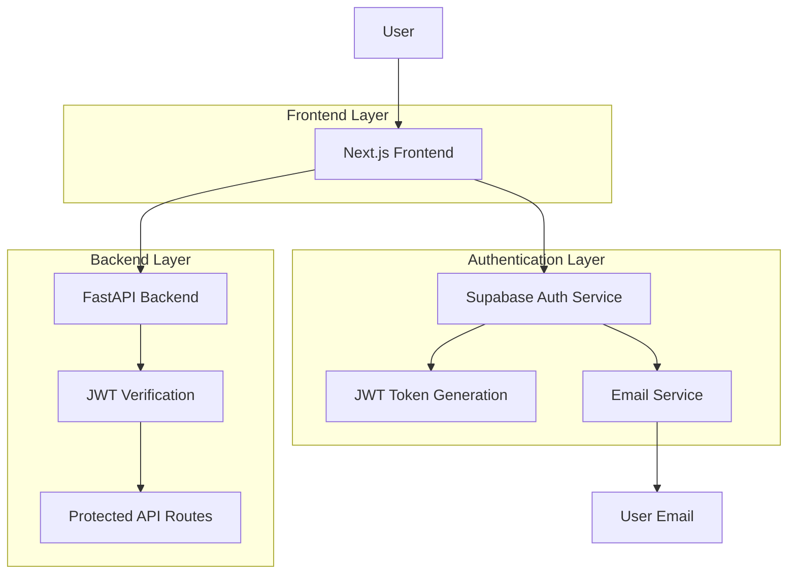

# Thiết Kế Hệ Thống & Kiến Trúc

## Tổng Quan Kiến Trúc

**Cấu trúc hệ thống cấp cao là gì?**



**Các thành phần chính và trách nhiệm của chúng:**

- **Next.js Frontend**: Xử lý UI auth, quản lý auth state, gọi Supabase client
- **Supabase Auth**: Xử lý đăng ký, đăng nhập, reset password, quản lý users
- **FastAPI Backend**: Verify JWT tokens, cung cấp API protected
- **Email Service**: Gửi email xác nhận và reset password

**Lựa chọn stack công nghệ:**

- Supabase Auth: Đơn giản, bảo mật, tích hợp sẵn với PostgreSQL
- @supabase/ssr: Tối ưu cho Next.js server components
- JWT: Stateless authentication, không cần session store

## Mô Hình Dữ Liệu

**Chúng ta cần quản lý dữ liệu nào?**

Supabase Auth tự động quản lý:

- `auth.users`: Bảng hệ thống chứa thông tin user
  - `id`: UUID primary key
  - `email`: Email address (unique)
  - `encrypted_password`: Password hash
  - `email_confirmed_at`: Timestamp xác nhận email
  - `created_at`, `updated_at`: Timestamps
  - `user_metadata`: JSON cho thông tin bổ sung (tên, role, etc.)

**Luồng dữ liệu:**

1. User đăng ký → Supabase tạo record trong auth.users
2. Supabase gửi email xác nhận → User click link → email_confirmed_at được set
3. User đăng nhập → Supabase verify credentials → trả về JWT
4. Frontend gửi JWT cho Backend → Backend verify với Supabase public key

## Thiết Kế API

**Các thành phần giao tiếp như thế nào?**

**Frontend ↔ Supabase Auth:**

```typescript
// Client-side auth methods
const { data, error } = await supabase.auth.signUp({
  email: "user@example.com",
  password: "password123",
});

const { data, error } = await supabase.auth.signInWithPassword({
  email: "user@example.com",
  password: "password123",
});

const { error } = await supabase.auth.resetPasswordForEmail("user@example.com");
```

**Frontend ↔ Backend:**

```typescript
// Protected API calls
const response = await fetch("/api/protected", {
  headers: {
    Authorization: `Bearer ${jwt_token}`,
  },
});
```

**Backend JWT Verification:**

```python
# FastAPI dependency
async def get_current_user(token: str = Depends(oauth2_scheme)):
    try:
        payload = jwt.decode(token, SUPABASE_JWT_SECRET, algorithms=["HS256"])
        user_id = payload.get("sub")
        return user_id
    except JWTError:
        raise HTTPException(status_code=401, detail="Invalid token")
```

## Phân Tích Thành Phần

**Các khối xây dựng chính là gì?**

**Frontend Components:**

- `app/auth/` - Route group cho auth pages
  - `login/page.tsx` - Đăng nhập
  - `register/page.tsx` - Đăng ký
  - `forgot-password/page.tsx` - Quên mật khẩu
  - `reset-password/page.tsx` - Reset mật khẩu
- `components/auth/` - Auth components
  - `AuthLayout.tsx` - Layout chung cho auth pages
  - `LoginForm.tsx` - Form đăng nhập với validation
  - `RegisterForm.tsx` - Form đăng ký
  - `ForgotPasswordForm.tsx` - Form quên mật khẩu
- `lib/auth/` - Auth utilities
  - `supabase.ts` - Supabase client config
  - `auth-context.tsx` - React context cho auth state
  - `middleware.ts` - Next.js middleware cho protected routes

**Backend Components:**

- `app/core/auth.py` - JWT verification utilities
- `app/api/deps.py` - FastAPI dependencies cho auth
- `app/api/v1/auth.py` - Auth-related endpoints (nếu cần)

**Database/Storage:**

- Supabase PostgreSQL: auth.users table
- Không cần custom tables cho basic auth

## Quyết Định Thiết Kế

**Tại sao chúng ta chọn cách tiếp cận này?**

**Supabase Auth vs Custom Auth:**

- **Supabase**:
  - ✅ Bảo mật cao (OWASP compliant)
  - ✅ Email service built-in
  - ✅ Rate limiting, brute force protection
  - ✅ JWT standard với public key verification
  - ✅ Tích hợp dễ với PostgreSQL
- **Custom Auth**:
  - ❌ Phức tạp implement
  - ❌ Nhiều security risks
  - ❌ Tốn thời gian maintain

**@supabase/ssr vs @supabase/supabase-js:**

- @supabase/ssr tối ưu cho Next.js App Router
- Xử lý server/client components properly
- Automatic token refresh

**JWT vs Session-based:**

- JWT: Stateless, scalable, không cần Redis
- Phù hợp với kiến trúc microservices

## Yêu Cầu Phi Chức Năng

**Hệ thống nên hoạt động như thế nào?**

**Security:**

- JWT expires trong 1 giờ
- Refresh token cho auto-renewal
- Password hashing với bcrypt
- Rate limiting: 10 attempts/minute per IP
- CSRF protection với SameSite cookies

**Performance:**

- Auth state load: <100ms
- JWT verification: <10ms
- Email delivery: <5 seconds
- Concurrent users: 1000+ simultaneous

**Scalability:**

- Supabase handle horizontal scaling
- Stateless JWT không cần sticky sessions
- CDN cho static assets

**Reliability:**

- Supabase SLA: 99.9% uptime
- Email retry mechanism
- Graceful degradation khi auth service down

**Usability:**

- Responsive design (mobile-first)
- Loading states cho tất cả actions
- Clear error messages bằng tiếng Việt
- Auto-redirect sau login/register
