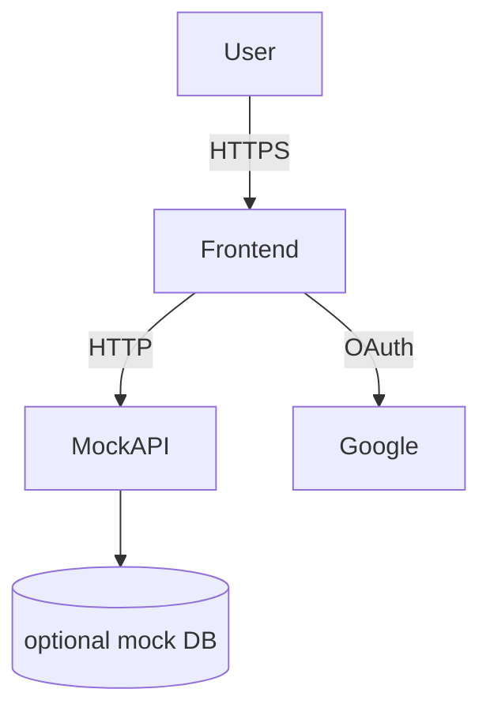

# Thiết Kế Hệ Thống & Kiến Trúc

## Tổng Quan Kiến Trúc

**Cấu trúc hệ thống cấp cao**

- Frontend: Next.js (App Router) — các trang/modal: `SignUp`, `SignIn`, `ResetPassword`.
- Backend: (không bắt buộc ở bước này) — mock API cho phép demo luồng xác thực.

Mermaid (khung):

## Mô Hình Dữ Liệu

**Thực thể chính (tối thiểu cho UI demo)**

- User
  - id: uuid
  - name: string
  - email: string
  - email_verified: boolean
  - created_at: timestamp

(Lưu trữ thực tế quản lý bởi Supabase/Backend; UI chỉ cần fields để hiển thị và validate.)

## Thiết Kế API

**Endpoints (mock)**

- POST `/api/auth/register` — body: `{ name, email, password }` → trả về 201/400
- POST `/api/auth/login` — body: `{ email, password }` → trả về 200 + token/401
- POST `/api/auth/reset` — body: `{ email }` → trả về 200 (Đã gửi email)
- GET `/api/auth/oauth/google` — redirect OAuth (ngoại scope)

Định dạng response: JSON với `{ success: boolean, message?: string, data?: {} }`

## Phân Tích Thành Phần

**Frontend components**

- `SignUpForm` (component)

  - Fields: displayName, email, password, passwordConfirm
  - Buttons: `Đăng ký`, `Đăng ký với Google`
  - Behavior: validate onChange, show errors inline, success → show dialog/modal

- `SignInForm`

  - Fields: email, password
  - Buttons: `Đăng nhập`, `Đăng nhập với Google`, `Quên mật khẩu?`
  - Behavior: validate onChange, on success redirect `/dashboard`

- `ResetPasswordForm`

  - Field: email
  - Buttons: `Gửi email`, `Quay về trang chủ`
  - Behavior: validate onChange, show confirmation on success

- Shared
  - `frontend/components/auth/messages.ts` — chuỗi text & lỗi
  - Reuse `Form`, `FormField`, `FormItem`, `FormLabel`, `FormControl`, `FormMessage` từ `components/ui/form.tsx`.
  - Use `Input`, `Button`, `Label` components.

## Quyết Định Thiết Kế

- Validation: sử dụng `react-hook-form` với `mode: 'onChange'` cho realtime validation.
- Thông báo lỗi: hiển thị inline bằng `FormMessage` + style đỏ (sử dụng class `text-destructive`/theme).
- Password visibility: dùng icon eye (đã có `input-26.tsx` làm ví dụ).
- Text strings: tách vào `messages.ts` để dễ i18n và tránh hardcode.
- OAuth Google: hiển thị nút, thực tích hợp OAuth tách riêng.

## Yêu Cầu Phi Chức Năng

- Hiệu suất: forms nhẹ, validation chạy trên client.
- Khả năng truy cập: đảm bảo `aria-invalid`, `aria-describedby` đã được set bởi `FormControl`.
- Bảo mật: không lưu mật khẩu trong localStorage; HTTPS khi gọi API; validate input phía client + server khi có backend.
