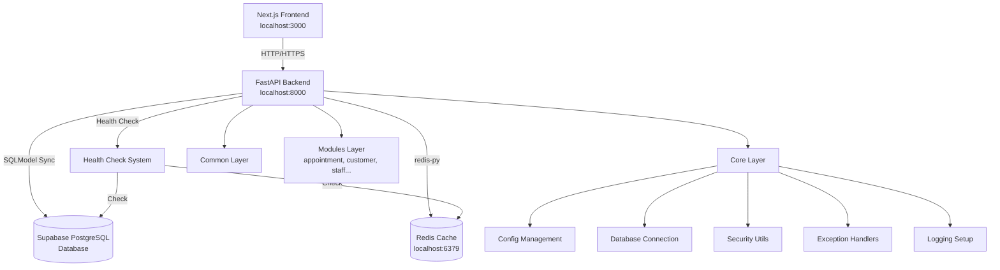
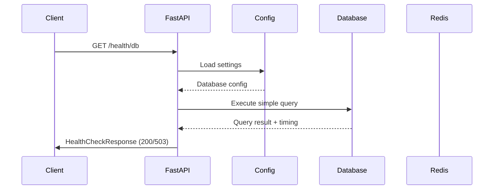
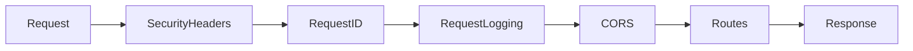

# Thiết Kế Hệ Thống & Kiến Trúc - Nền Tảng Backend

## Tổng Quan Kiến Trúc

**Cấu trúc hệ thống cấp cao là gì?**

### Sơ đồ kiến trúc tổng quan



### Các thành phần chính

1. **FastAPI Application (`main.py`)**

   - Entry point của backend
   - Khởi tạo app với middleware, exception handlers
   - Mount các router từ modules
   - Lifecycle events (startup/shutdown)

2. **Core Layer (`app/core/`)**

   - `config.py`: Quản lý environment variables với Pydantic Settings
   - `database.py`: Database connection, engine, session management
   - `security.py`: Security utilities (JWT verification sẽ làm sau)
   - `exceptions.py`: Custom exceptions và handlers
   - `logging.py`: Logging configuration

3. **Common Layer (`app/common/`)**

   - `schemas.py`: Pydantic schemas dùng chung (Response, Pagination...)
   - `helpers.py`: Utility functions
   - `constants.py`: Constants và enums

4. **Redis Layer (`app/redis/`)**

   - `client.py`: Redis connection management
   - `helpers.py`: Cache get/set/delete helpers

5. **API Layer (`app/api/`)**

   - `api_v1.py`: Router tổng hợp tất cả module routers
   - `health.py`: Health check endpoints

6. **Modules Layer (`app/modules/`) - Chuẩn bị cấu trúc**
   - Thư mục trống, sẵn sàng cho các domain modules

### Lựa chọn stack công nghệ và lý do

| Công nghệ           | Lý do chọn                                                     |
| ------------------- | -------------------------------------------------------------- |
| **FastAPI**         | High performance, async support, auto docs, type hints         |
| **Pydantic**        | Data validation, settings management, tích hợp tốt với FastAPI |
| **SQLModel**        | Kết hợp SQLAlchemy + Pydantic, type-safe (sync mode)           |
| **psycopg2-binary** | Sync PostgreSQL driver, ổn định và hỗ trợ chính thức           |
| **redis-py**        | Official Redis client, async support                           |
| **python-dotenv**   | Load environment variables từ .env                             |
| **uvicorn**         | ASGI server, production-ready                                  |

## Mô Hình Dữ Liệu

**Chúng ta cần quản lý dữ liệu nào?**

### Configuration Data Model

```python
# app/core/config.py
from pydantic_settings import BaseSettings

class Settings(BaseSettings):
    # Application
    APP_NAME: str = "ZenSpa Backend"
    APP_VERSION: str = "0.1.0"
    DEBUG: bool = False
    ENVIRONMENT: str = "development"  # development, staging, production

    # Server
    HOST: str = "0.0.0.0"
    PORT: int = 8000

    # CORS
    CORS_ORIGINS: list[str] = ["http://localhost:3000"]

    # Database (Supabase PostgreSQL)
    DATABASE_URL: str
    DB_POOL_SIZE: int = 10
    DB_MAX_OVERFLOW: int = 10
    DB_POOL_TIMEOUT: int = 30
    DB_ECHO: bool = False

    # Redis
    REDIS_HOST: str = "localhost"
    REDIS_PORT: int = 6379
    REDIS_DB: int = 0
    REDIS_PASSWORD: str | None = None
    REDIS_DECODE_RESPONSES: bool = True

    # Logging
    LOG_LEVEL: str = "INFO"

    class Config:
        env_file = ".env"
        case_sensitive = True
```

### Health Check Response Model

```python
# app/common/schemas.py
from pydantic import BaseModel
from datetime import datetime

class HealthCheckResponse(BaseModel):
    status: str  # "healthy" | "unhealthy"
    timestamp: datetime
    service: str
    version: str

class DatabaseHealthResponse(HealthCheckResponse):
    database: str
    connected: bool
    response_time_ms: float

class RedisHealthResponse(HealthCheckResponse):
    redis: str
    connected: bool
    response_time_ms: float
```

### Luồng dữ liệu



## Thiết Kế API

**Các thành phần giao tiếp như thế nào?**

### API Endpoints

#### Health Check Endpoints

```
GET /health
- Description: Kiểm tra trạng thái tổng quan
- Response: 200 OK
{
  "status": "healthy",
  "timestamp": "2025-11-15T10:30:00Z",
  "service": "ZenSpa Backend",
  "version": "0.1.0"
}

GET /health/db
- Description: Kiểm tra kết nối PostgreSQL
- Response: 200 OK | 503 Service Unavailable
{
  "status": "healthy",
  "timestamp": "2025-11-15T10:30:00Z",
  "service": "ZenSpa Backend",
  "version": "0.1.0",
  "database": "postgresql",
  "connected": true,
  "response_time_ms": 45.2
}

GET /health/redis
- Description: Kiểm tra kết nối Redis
- Response: 200 OK | 503 Service Unavailable
{
  "status": "healthy",
  "timestamp": "2025-11-15T10:30:00Z",
  "service": "ZenSpa Backend",
  "version": "0.1.0",
  "redis": "localhost:6379",
  "connected": true,
  "response_time_ms": 12.5
}
```

#### API Documentation Endpoints

```
GET /docs - Swagger UI
GET /redoc - ReDoc
GET /openapi.json - OpenAPI schema
```

### Response Format Chuẩn

#### Success Response

```json
{
  "status": "success",
  "data": {...},
  "message": "Operation completed successfully"
}
```

#### Error Response

```json
{
  "status": "error",
  "error": {
    "code": "VALIDATION_ERROR",
    "message": "Invalid input data",
    "details": [...]
  },
  "timestamp": "2025-11-15T10:30:00Z"
}
```

### Xác thực/Ủy quyền

**Giai đoạn foundation này:** Không implement authentication
**Giai đoạn sau:** Sẽ verify Supabase JWT token từ header `Authorization: Bearer <token>`

## Phân Tích Thành Phần

**Các khối xây dựng chính là gì?**

### 1. FastAPI Application (`app/main.py`)

**Trách nhiệm:**

- Khởi tạo FastAPI instance
- Cấu hình CORS middleware
- Đăng ký exception handlers
- Mount API routers
- Startup/shutdown events (connect/disconnect DB, Redis)

**Dependencies:**

- `app.core.config`
- `app.core.database`
- `app.core.exceptions`
- `app.api.api_v1`

### 2. Configuration Management (`app/core/config.py`)

**Trách nhiệm:**

- Load và validate environment variables
- Provide type-safe settings object
- Support multiple environments

**Pattern:** Singleton Settings object

### 3. Database Layer (`app/core/database.py`)

**Trách nhiệm:**

- Create SQLAlchemy engine với sync mode
- Manage connection pool
- Provide session factory với sync operations
- Health check queries
- Wrap sync DB operations trong asyncio.run_in_executor() cho FastAPI async compatibility

**Key Functions:**

```python
def get_session() -> Session
def check_database_health() -> tuple[bool, float]
def init_db() -> None
def close_db() -> None
```

### 4. Redis Layer (`app/redis/client.py`, `app/redis/helpers.py`)

**Trách nhiệm:**

- Manage Redis connection
- Provide cache helpers
- Health check ping

**Key Functions:**

```python
async def get_redis_client() -> Redis
async def check_redis_health() -> tuple[bool, float]
async def cache_get(key: str) -> Any
async def cache_set(key: str, value: Any, ttl: int) -> bool
async def cache_delete(key: str) -> bool
```

### 5. Exception Handling (`app/core/exceptions.py`)

**Trách nhiệm:**

- Define custom exceptions
- Exception handlers cho FastAPI
- Standardize error responses

**Custom Exceptions:**

```python
class ZenSpaException(Exception)
class DatabaseException(ZenSpaException)
class CacheException(ZenSpaException)
class ValidationException(ZenSpaException)
```

### 6. Health Check Service (`app/api/health.py`)

**Trách nhiệm:**

- Health check endpoints
- Aggregate health status từ các services

### 7. Common Schemas (`app/common/schemas.py`)

**Trách nhiệm:**

- Pydantic models dùng chung
- Response wrappers
- Base schemas

## Quyết Định Thiết Kế

**Tại sao chúng ta chọn cách tiếp cận này?**

### 1. Sync Database với Async Compatibility

**Quyết định:** Sử dụng SQLModel sync mode cho database operations, wrap trong asyncio.run_in_executor() cho FastAPI async

**Lý do:**

- SQLModel sync mode được hỗ trợ chính thức và ổn định
- psycopg2-binary reliable hơn asyncpg trong production
- Async compatibility qua thread pool để maintain FastAPI async benefits
- Chuẩn bị cho real-time features (Socket.io)

**Trade-offs:**

- Thread pool overhead nhỏ
- Code phức tạp hơn pure async
- ✅ Stability và reliability cao hơn

### 2. Pydantic Settings cho Configuration

**Quyết định:** Dùng `pydantic_settings.BaseSettings` thay vì `os.getenv()`

**Lý do:**

- Type validation tự động
- Default values rõ ràng
- Auto-complete trong IDE
- Environment variables documented trong code

**Alternative:** python-decouple, dynaconf
**Why not:** Pydantic tích hợp tốt với FastAPI, đơn giản hơn

### 3. Module Structure theo Domain

**Quyết định:** `app/modules/{domain}/{domain}-{type}.py`

**Lý do:**

- Domain-Driven Design
- Dễ tìm code theo nghiệp vụ
- Team có thể work parallel trên các domain khác nhau
- Scale tốt khi project lớn

**Alternative:** Layered architecture (models/, services/, routes/)
**Why not:** Khó maintain khi có nhiều domain, file scatter

### 4. Health Check Riêng Cho Từng Service

**Quyết định:** `/health/db`, `/health/redis` riêng biệt

**Lý do:**

- Pinpoint được service nào down
- Kubernetes/Docker health probe chi tiết hơn
- Debug dễ hơn

**Alternative:** Một endpoint `/health` tổng hợp
**Why not:** Khó biết chính xác service nào lỗi

### 5. SQLModel thay vì SQLAlchemy thuần

**Quyết định:** Dùng SQLModel (khi có models)

**Lý do:**

- Combine SQLAlchemy + Pydantic
- Ít boilerplate code
- Type hints tốt hơn
- Pydantic validation cho ORM models

**Alternative:** SQLAlchemy + separate Pydantic schemas
**Why not:** Duplicate code giữa ORM model và Pydantic schema

## Yêu Cầu Phi Chức Năng

**Hệ thống nên hoạt động như thế nào?**

### Mục tiêu hiệu suất

- **API response time:** < 100ms cho health checks
- **Database connection time:** < 500ms
- **Redis operation:** < 50ms
- **Startup time:** < 3s
- **Memory footprint:** < 200MB khi idle

### Cân nhắc khả năng mở rộng

- **Connection pooling:**
  - PostgreSQL: min 5, max 20 connections
  - Redis: connection pool với max 10 connections
- **Async support:** Tất cả I/O operations
- **Stateless design:** Không lưu state trong memory (dùng Redis nếu cần)

### Yêu cầu bảo mật

- **Secrets management:** Environment variables, không hardcode
- **Database credentials:** Không log, không expose trong errors
- **CORS:** Whitelist origins, không allow `*`
- **Input validation:** Pydantic validation cho tất cả inputs
- **Error messages:** Không expose internal details ra client

### Yêu Cầu Độ Tin Cậy

- **Database retry:** Retry 3 lần với exponential backoff khi connect fail
- **Redis fallback:** App vẫn chạy khi Redis down (log warning)
- **Graceful shutdown:** Close connections properly khi shutdown
- **Health checks:** Expose health status cho monitoring tools

### Logging & Monitoring

- **Log levels:** DEBUG, INFO, WARNING, ERROR, CRITICAL
- **Log format:** JSON structured logging (timestamp, level, message, context)
- **Log targets:** Console (development), File (production)
- **Metrics:** Response time, request count (chuẩn bị cho Prometheus)

### Development Experience

- **Auto-reload:** Uvicorn --reload trong development
- **API docs:** Swagger UI và ReDoc
- **Type hints:** 100% type coverage với mypy
- **Linting:** Black, Ruff, isort
- **Testing:** Pytest với async support

## Security Design

**Làm thế nào để đảm bảo ứng dụng an toàn?**

### Security Headers Middleware

```python
# app/core/middleware.py
from fastapi import Request
from starlette.middleware.base import BaseHTTPMiddleware

class SecurityHeadersMiddleware(BaseHTTPMiddleware):
    """Apply security headers to all responses"""

    HEADERS = {
        "X-Content-Type-Options": "nosniff",
        "X-Frame-Options": "DENY",
        "X-XSS-Protection": "1; mode=block",
        "Strict-Transport-Security": "max-age=31536000; includeSubDomains",
        "X-Permitted-Cross-Domain-Policies": "none",
        "Referrer-Policy": "strict-origin-when-cross-origin",
    }

    async def dispatch(self, request: Request, call_next):
        response = await call_next(request)
        for header, value in self.HEADERS.items():
            response.headers[header] = value
        return response
```

### Request ID Middleware

```python
# app/core/middleware.py
import uuid
from fastapi import Request

class RequestIDMiddleware(BaseHTTPMiddleware):
    """Generate and track request ID"""

    async def dispatch(self, request: Request, call_next):
        # Get or generate request ID
        request_id = request.headers.get("X-Request-ID", str(uuid.uuid4()))

        # Store in request state
        request.state.request_id = request_id

        # Process request
        response = await call_next(request)

        # Add to response header
        response.headers["X-Request-ID"] = request_id

        return response
```

### Secrets Management

```python
# app/core/config.py
from pydantic import field_validator

class Settings(BaseSettings):
    # Sensitive fields
    DATABASE_URL: str
    SUPABASE_URL: str
    SUPABASE_SERVICE_ROLE_KEY: str
    REDIS_PASSWORD: str | None = None

    @field_validator('DATABASE_URL')
    def validate_database_url(cls, v):
        """Validate database URL format"""
        if not v.startswith('postgresql'):
            raise ValueError('DATABASE_URL must start with postgresql')
        # Don't log the actual value
        return v

    class Config:
        # Ensure .env file is used
        env_file = ".env"
        # Don't allow extra fields
        extra = "forbid"
```

### Input Sanitization

- Tất cả request data được validate qua Pydantic schemas
- SQL injection prevention qua SQLModel parameterized queries
- XSS prevention qua automatic escaping trong responses

## Error Handling Design

**Cách xử lý lỗi chuẩn hóa**

### Error Code Enumeration

```python
# app/core/exceptions.py
from enum import Enum

class ErrorCode(str, Enum):
    # Client errors (4xx)
    VALIDATION_ERROR = "VALIDATION_ERROR"
    NOT_FOUND = "NOT_FOUND"
    UNAUTHORIZED = "UNAUTHORIZED"
    FORBIDDEN = "FORBIDDEN"

    # Server errors (5xx)
    DATABASE_ERROR = "DATABASE_ERROR"
    CACHE_ERROR = "CACHE_ERROR"
    INTERNAL_ERROR = "INTERNAL_ERROR"
    SERVICE_UNAVAILABLE = "SERVICE_UNAVAILABLE"
```

### Standard Error Response

```python
# app/common/schemas.py
from pydantic import BaseModel
from datetime import datetime

class ErrorDetail(BaseModel):
    code: str
    message: str
    details: dict | None = None

class ErrorResponse(BaseModel):
    status: str = "error"
    error: ErrorDetail
    timestamp: datetime
    request_id: str | None = None
```

### Custom Exceptions

```python
# app/core/exceptions.py
from dataclasses import dataclass
from fastapi import status

@dataclass
class ZenSpaException(Exception):
    """Base exception for ZenSpa"""
    message: str
    code: ErrorCode
    status_code: int = status.HTTP_500_INTERNAL_SERVER_ERROR
    details: dict | None = None

class DatabaseException(ZenSpaException):
    """Database related errors"""
    def __init__(self, message: str, details: dict | None = None):
        super().__init__(
            message=message,
            code=ErrorCode.DATABASE_ERROR,
            status_code=status.HTTP_503_SERVICE_UNAVAILABLE,
            details=details
        )

class ValidationException(ZenSpaException):
    """Validation errors"""
    def __init__(self, message: str, details: dict | None = None):
        super().__init__(
            message=message,
            code=ErrorCode.VALIDATION_ERROR,
            status_code=status.HTTP_422_UNPROCESSABLE_ENTITY,
            details=details
        )
```

### Exception Handlers

```python
# app/core/exceptions.py
from fastapi import Request, status
from fastapi.responses import JSONResponse
from datetime import datetime

async def zenspa_exception_handler(request: Request, exc: ZenSpaException):
    """Handle custom ZenSpa exceptions"""
    return JSONResponse(
        status_code=exc.status_code,
        content={
            "status": "error",
            "error": {
                "code": exc.code,
                "message": exc.message,
                "details": exc.details,
            },
            "timestamp": datetime.utcnow().isoformat(),
            "request_id": getattr(request.state, "request_id", None),
        },
    )

async def validation_exception_handler(request: Request, exc: RequestValidationError):
    """Handle Pydantic validation errors"""
    return JSONResponse(
        status_code=status.HTTP_422_UNPROCESSABLE_ENTITY,
        content={
            "status": "error",
            "error": {
                "code": "VALIDATION_ERROR",
                "message": "Invalid input data",
                "details": exc.errors(),
            },
            "timestamp": datetime.utcnow().isoformat(),
            "request_id": getattr(request.state, "request_id", None),
        },
    )

async def general_exception_handler(request: Request, exc: Exception):
    """Catch-all handler for unexpected exceptions"""
    # Log full exception for debugging
    logger.exception(f"Unhandled exception: {exc}")

    return JSONResponse(
        status_code=status.HTTP_500_INTERNAL_SERVER_ERROR,
        content={
            "status": "error",
            "error": {
                "code": "INTERNAL_ERROR",
                "message": "An unexpected error occurred",
                # Don't expose exception details in production
            },
            "timestamp": datetime.utcnow().isoformat(),
            "request_id": getattr(request.state, "request_id", None),
        },
    )
```

## Database Retry Strategy

**Xử lý database connection failures**

### Retry với Tenacity

```python
# app/core/database.py
from tenacity import retry, stop_after_attempt, wait_exponential, retry_if_exception_type
from sqlalchemy.exc import OperationalError, DBAPIError

@retry(
    stop=stop_after_attempt(3),
    wait=wait_exponential(multiplier=1, min=2, max=10),
    retry=retry_if_exception_type((OperationalError, DBAPIError)),
    reraise=True
)
def init_db() -> None:
    """
    Initialize database with retry mechanism.
    Retries 3 times with exponential backoff (2s, 4s, 8s).
    """
    try:
        with engine.connect() as conn:
            conn.execute(text("SELECT 1"))
        logger.info("✅ Database connected successfully")
    except Exception as e:
        logger.error(f"❌ Database connection failed: {e}")
        raise DatabaseException(f"Failed to initialize database: {e}")
```

### Connection Context Manager

```python
# app/core/database.py
from contextlib import contextmanager

@contextmanager
def get_session():
    """
    Context manager for database sessions.
    Automatically commits on success, rolls back on error.
    """
    session = SessionLocal()
    try:
        yield session
        session.commit()
    except Exception:
        session.rollback()
        raise
    finally:
        session.close()
```

## Redis Fallback Strategy

**Graceful degradation khi Redis unavailable**

```python
# app/redis/helpers.py
import logging

logger = logging.getLogger(__name__)

async def cache_get(key: str, fallback: Any = None) -> Any:
    """
    Get value from cache with fallback.
    If Redis unavailable, return fallback value.
    """
    try:
        redis = await get_redis_client()
        if redis is None:
            logger.warning(f"Redis unavailable, returning fallback for {key}")
            return fallback

        value = await redis.get(key)
        return json.loads(value) if value else fallback

    except RedisConnectionError:
        logger.warning(f"Redis connection error, returning fallback for {key}")
        return fallback
    except Exception as e:
        logger.error(f"Cache error: {e}, returning fallback")
        return fallback

async def cache_set(key: str, value: Any, ttl: int = 3600) -> bool:
    """
    Set value in cache.
    Returns False if Redis unavailable (app continues).
    """
    try:
        redis = await get_redis_client()
        if redis is None:
            logger.warning(f"Redis unavailable, skipping cache set for {key}")
            return False

        await redis.setex(key, ttl, json.dumps(value))
        return True

    except Exception as e:
        logger.error(f"Cache set error: {e}")
        return False
```

## Logging Structure

**Structured JSON logging cho production**

```python
# app/core/logging.py
import logging
import json
import sys
from datetime import datetime
from app.core.config import settings

class JSONFormatter(logging.Formatter):
    """Format logs as JSON for structured logging"""

    def format(self, record: logging.LogRecord) -> str:
        log_data = {
            "timestamp": datetime.utcnow().isoformat(),
            "level": record.levelname,
            "logger": record.name,
            "message": record.getMessage(),
            "module": record.module,
            "function": record.funcName,
            "line": record.lineno,
        }

        # Add request_id if available
        if hasattr(record, 'request_id'):
            log_data["request_id"] = record.request_id

        # Add exception info if present
        if record.exc_info:
            log_data["exception"] = self.formatException(record.exc_info)

        return json.dumps(log_data)

def setup_logging():
    """Setup logging configuration"""
    # Get log level from settings
    log_level = getattr(logging, settings.LOG_LEVEL.upper())

    # Create formatter
    if settings.ENVIRONMENT == "production":
        formatter = JSONFormatter()
    else:
        formatter = logging.Formatter(
            "%(asctime)s | %(levelname)-8s | %(name)s | %(message)s",
            datefmt="%Y-%m-%d %H:%M:%S"
        )

    # Configure handler
    handler = logging.StreamHandler(sys.stdout)
    handler.setFormatter(formatter)

    # Configure root logger
    logging.basicConfig(
        level=log_level,
        handlers=[handler]
    )

    # Reduce noise from external libraries
    logging.getLogger("uvicorn.access").setLevel(logging.WARNING)
    logging.getLogger("sqlalchemy.engine").setLevel(logging.WARNING)
```

## API Versioning Strategy

**Support multiple API versions**

```python
# app/api/api_v1.py
from fastapi import APIRouter

# Create versioned router
api_v1_router = APIRouter(prefix="/api/v1", tags=["v1"])

# Include domain routers
api_v1_router.include_router(health.router)
# Future: api_v1_router.include_router(appointment.router)

# app/main.py
app.include_router(api_v1_router)

# Health checks can be global (not versioned)
app.include_router(health.router, prefix="/health", tags=["health"])
```

### Versioning Policy

- Hiện tại: `/api/v1/` cho tất cả endpoints
- Deprecation: Support v(n-1) trong 6 tháng khi release v(n)
- Breaking changes: Chỉ trong major version mới
- Health checks: Global `/health` không versioned

## Middleware Pipeline

**Thứ tự execution của middlewares**



```python
# app/main.py - Middleware registration order
app.add_middleware(SecurityHeadersMiddleware)
app.add_middleware(RequestIDMiddleware)
app.add_middleware(
    CORSMiddleware,
    allow_origins=settings.cors_origins_list,
    allow_credentials=True,
    allow_methods=["*"],
    allow_headers=["*"],
)
```

## Alembic Infrastructure

**Database migration setup (chưa tạo migrations)**

### Folder Structure

```
backend/
├── alembic/
│   ├── versions/           # Migration files sẽ ở đây
│   ├── env.py             # Alembic environment config
│   ├── script.py.mako     # Migration template
│   └── README
├── alembic.ini            # Alembic configuration
```

### Configuration

```python
# alembic/env.py
from app.core.database import engine
from app.core.config import settings

# Set SQLModel metadata for autogenerate
target_metadata = SQLModel.metadata

# Use sync engine
connectable = engine
```

```ini
# alembic.ini
[alembic]
script_location = alembic
sqlalchemy.url = # Will be overridden by env.py

[post_write_hooks]
hooks = black
black.type = console_scripts
black.entrypoint = black
```

### Commands (for future use)

```bash
# Initialize Alembic (done in setup)
alembic init alembic

# Create migration (when models added)
alembic revision --autogenerate -m "description"

# Apply migrations
alembic upgrade head

# Rollback
alembic downgrade -1
```
