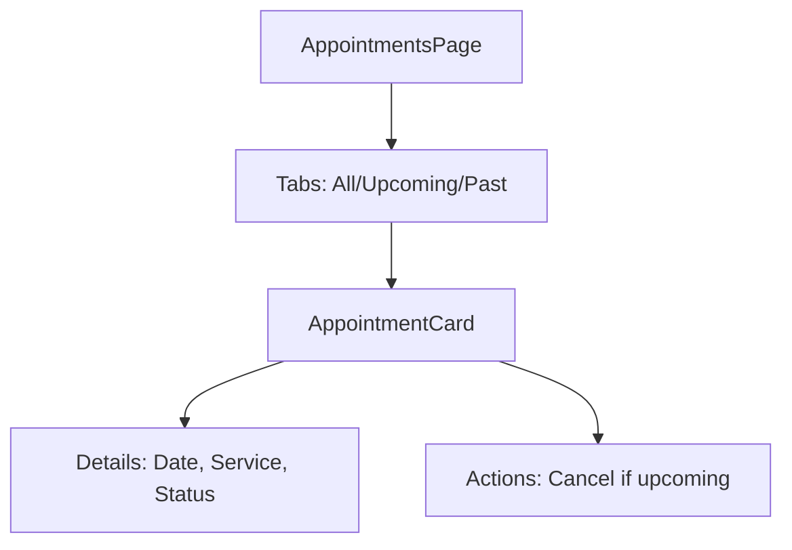

# Thiết Kế

## Kiến Trúc Hệ Thống

- Component: AppointmentsPage với Tabs (All, Upcoming, Past)
- Data: Fetch từ Supabase table 'appointments'
- UI: Card list với details (date, service, status)

## Quyết Định Thiết Kế

- Sử dụng Tabs từ Shadcn/UI cho filter
- Card cho mỗi appointment với actions (cancel for upcoming)
- Responsive grid

## Sơ Đồ

