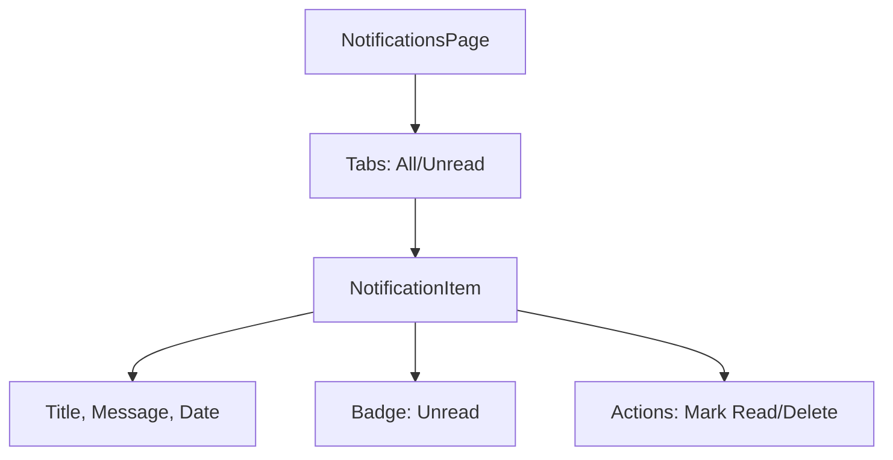

# Thiết Kế

## Kiến Trúc Hệ Thống

- Component: NotificationsPage với filter tabs
- Data: Supabase 'notifications'
- UI: List với unread indicators

## Quyết Định Thiết Kế

- Badge cho unread count
- Actions: Mark read, Delete

## Sơ Đồ

