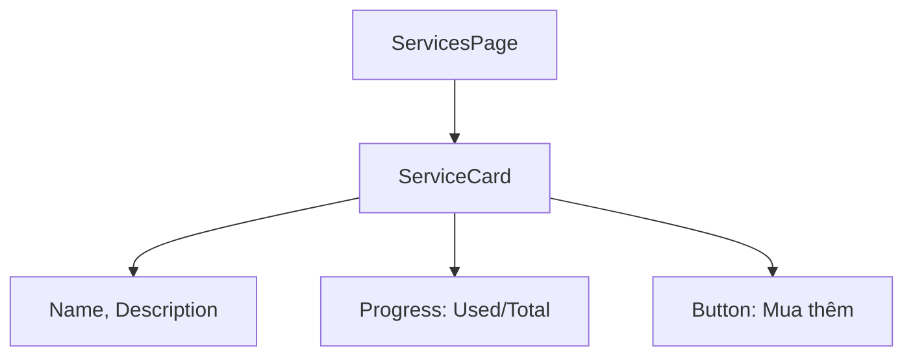

# Thiết Kế

## Kiến Trúc Hệ Thống

- Component: ServicesPage với list of ServiceCard
- Data: Fetch từ Supabase 'services'
- UI: Card với progress bar cho remaining sessions

## Quyết Định Thiết Kế

- Progress bar từ Shadcn/UI cho visual remaining
- Button "Mua thêm" redirect to booking

## Sơ Đồ

