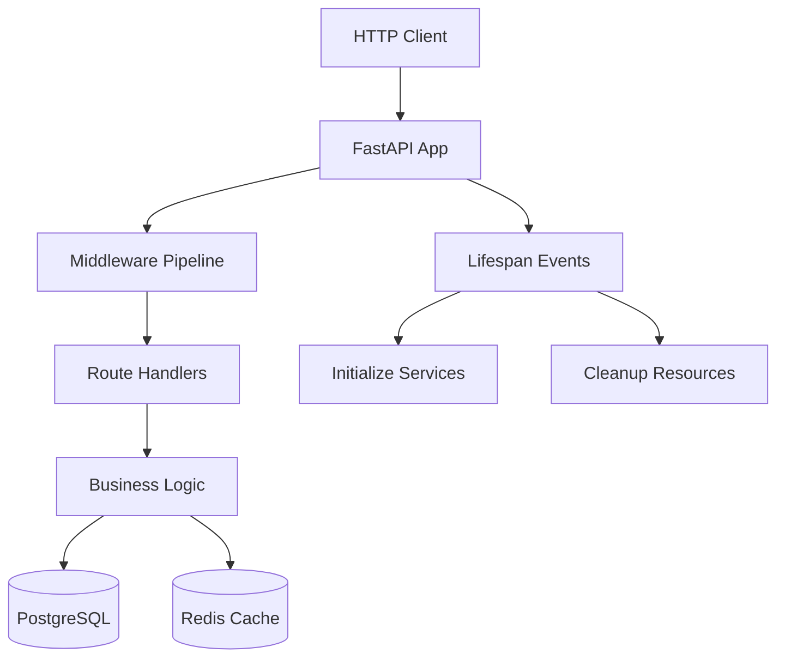
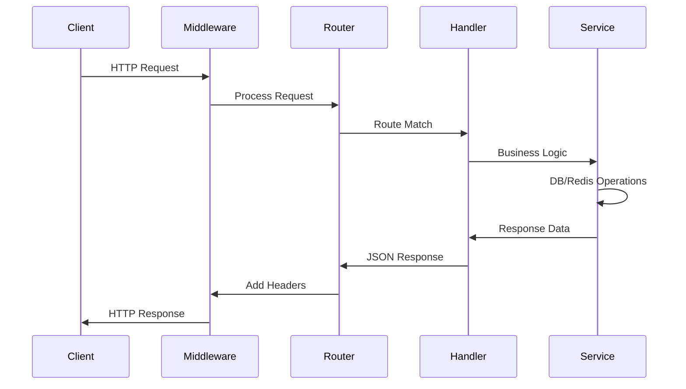
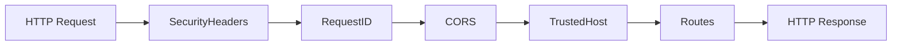

# Main App Entry Point

## Overview

**Entry Point:** `app/main.py`
**Language:** Python 3.12+
**Framework:** FastAPI
**Purpose:** Entry point chính của ứng dụng ZenSpa Backend, khởi tạo và cấu hình FastAPI application với tất cả middleware, exception handlers, và routers.

**High-level Behavior:**

- Khởi tạo FastAPI app với lifespan management
- Thiết lập middleware pipeline (security, CORS, request ID)
- Đăng ký exception handlers cho error handling chuẩn
- Mount API routers (v1, health)
- Cung cấp root endpoints cơ bản

## Implementation Details

### Core Logic

**Lifespan Management:**

```python
@asynccontextmanager
async def lifespan(app: FastAPI):
    # Startup: setup logging, init DB, Redis
    # Shutdown: close connections
```

**Middleware Pipeline:**

1. `SecurityHeadersMiddleware` - Thêm security headers
2. `RequestIDMiddleware` - Generate request ID
3. `CORSMiddleware` - Handle CORS
4. `TrustedHostMiddleware` - Production security

**Exception Handlers:**

- `ZenSpaException` - Custom business logic errors
- `RequestValidationError` - Pydantic validation errors
- `Exception` - Catch-all for unexpected errors

**Router Mounting:**

- `/api/v1` - Versioned API endpoints
- `/health` - Global health checks

### Key Components

**Root Endpoints:**

- `GET /` - Welcome message với app info
- `GET /ping` - Simple health ping

**Configuration Loading:**

- Load settings từ environment variables
- Validate database URL format
- Setup logging based on environment

### Execution Flow

```
App Start → Lifespan Startup → Setup Logging → Init DB → Init Redis
     ↓
Middleware Pipeline → Route Matching → Business Logic → Response
     ↓
Lifespan Shutdown → Close DB → Close Redis → App Stop
```

### Error Handling

**Standardized Error Responses:**

```json
{
  "status": "error",
  "error": {
    "code": "VALIDATION_ERROR",
    "message": "Dữ liệu đầu vào không hợp lệ",
    "details": [...]
  },
  "timestamp": "2025-11-16T...",
  "request_id": "uuid..."
}
```

**Exception Handler Priority:**

1. Custom ZenSpa exceptions
2. Pydantic validation errors
3. Generic exceptions (logged, sanitized response)

### Performance Considerations

- Async lifespan events for non-blocking startup/shutdown
- Connection pooling cho DB và Redis
- Request ID tracking cho distributed tracing
- Structured JSON logging cho production monitoring

### Security Design

- Security headers middleware cho tất cả responses
- Request ID injection cho tracking
- CORS configuration với whitelist origins
- Trusted host validation trong production

## Dependencies

### Direct Imports (Depth 1)

- `fastapi` - Web framework
- `app.core.config` - Settings management
- `app.core.logging` - Logging setup
- `app.core.database` - DB connection
- `app.redis.client` - Redis connection
- `app.core.exceptions` - Error handling
- `app.core.middleware` - Middleware classes
- `app.api.api_v1` - API router
- `app.api.health` - Health endpoints

### Indirect Dependencies (Depth 2-3)

- **External Packages:**

  - `pydantic` - Data validation
  - `sqlalchemy` - ORM
  - `redis` - Cache client
  - `tenacity` - Retry logic
  - `uvicorn` - ASGI server

- **Internal Modules:**
  - `app.common.schemas` - Response models
  - `app.core.config.settings` - App configuration
  - `app.core.logging.logger` - Logger instance

### Dependency Graph

```
main.py
├── fastapi (external)
├── config.py
│   ├── pydantic_settings (external)
│   └── pydantic (external)
├── logging.py
│   ├── logging (stdlib)
│   └── config.settings
├── database.py
│   ├── sqlalchemy (external)
│   ├── tenacity (external)
│   ├── config.settings
│   ├── exceptions.DatabaseException
│   └── logging.logger
├── redis/client.py
│   ├── redis (external)
│   ├── config.settings
│   ├── exceptions.CacheException
│   └── logging.logger
├── exceptions.py
│   ├── fastapi (external)
│   └── logging.logger
├── middleware.py
│   ├── starlette (external)
│   └── logging.logger
├── api/api_v1.py
│   └── api/health.py
└── api/health.py
    ├── common/schemas.py
    ├── config.settings
    ├── database.check_database_health
    ├── redis/client.check_redis_health
    └── logging.logger
```

## Visual Diagrams

### Application Architecture



### Request Flow



### Middleware Pipeline



## Additional Insights

### Design Patterns Used

- **Dependency Injection:** Settings và logger instances
- **Middleware Pattern:** Request/response processing pipeline
- **Context Manager:** Lifespan management
- **Factory Pattern:** Session factory cho DB connections

### Configuration Strategy

- Environment-based configuration
- Validation tại startup
- Fallback defaults cho development

### Monitoring & Observability

- Health check endpoints cho monitoring
- Structured logging với request IDs
- Error tracking với context

### Scalability Considerations

- Async/await cho non-blocking I/O
- Connection pooling
- Graceful shutdown handling

### Potential Improvements

- Add rate limiting middleware
- Implement API versioning strategy
- Add metrics collection (Prometheus)
- Consider dependency injection container

## Metadata

- **Analysis Date:** November 16, 2025
- **Depth Analyzed:** 3 levels
- **Files Touched:** 8 core files
- **Entry Point Type:** Application Entry Point
- **Language Version:** Python 3.12+
- **Framework:** FastAPI
- **External Dependencies:** 12 packages
- **Internal Dependencies:** 15 modules

## Next Steps

1. **Domain Modules:** Implement appointment, customer, staff modules
2. **Authentication:** Add Supabase JWT verification
3. **Testing:** Complete integration tests cho main app
4. **Monitoring:** Add metrics và alerting
5. **Performance:** Profile và optimize startup time
6. **Security:** Review và harden security headers

**Related Entry Points to Analyze:**

- `app/api/health.py` - Health check implementation
- `app/core/config.py` - Configuration management
- `app/core/database.py` - Database layer
- `app/modules/appointment/` - First domain module</content>
  <parameter name="filePath">e:\Projects\zenspa-platform\docs\ai\implementation\knowledge-main-app.md
