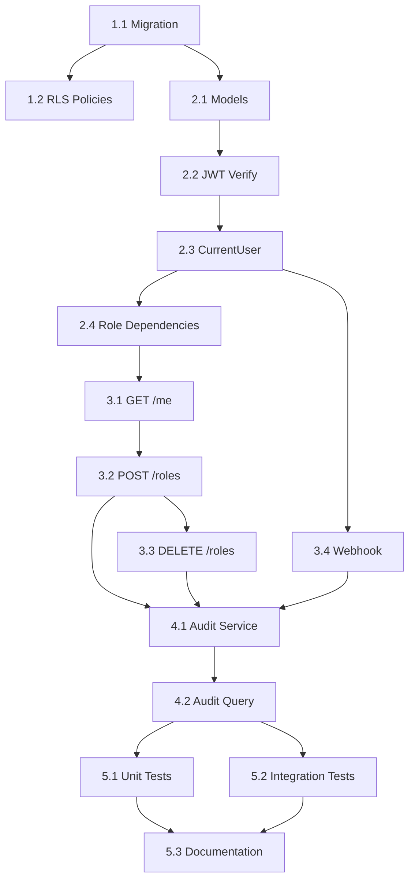

# Lập Kế Hoạch Dự Án & Phân Tích Nhiệm Vụ - Auth Backend Module

## Mốc Quan Trọng

**Các điểm kiểm tra chính:**

- [ ] **Milestone 1: Database Schema Ready** (Ngày 1-2)

  - Alembic migration cho profiles, user_roles, audit_logs
  - RLS policies setup
  - Indexes created

- [ ] **Milestone 2: Core Auth Working** (Ngày 3-4)

  - JWT verification hoạt động
  - get_current_user dependency working
  - Role checks functional

- [ ] **Milestone 3: API Endpoints Complete** (Ngày 5-6)

  - GET /auth/me endpoint
  - POST /auth/roles endpoint
  - Webhook handler for new users

- [ ] **Milestone 4: Production Ready** (Ngày 7-8)
  - Audit logging working
  - Caching implemented
  - All tests passing (100% coverage)
  - Documentation complete

## Phân Tích Nhiệm Vụ

### Giai Đoạn 1: Database Foundation (Ngày 1-2)

#### Task 1.1: Tạo Alembic Migration cho Auth Tables

**Mô tả:** Tạo migration script cho profiles, user_roles, audit_logs

**Status:** ✅ DONE

**Subtasks:**

- [x] Tạo file migration `002_create_auth_tables.py`
- [x] Define schema cho `profiles` table
  - Columns: id, user_id, full_name, avatar_url, created_at, updated_at
  - Foreign key: user_id → auth.users (ON DELETE CASCADE)
  - Unique constraint: user_id
  - Index: user_id
- [x] Define schema cho `user_roles` table
  - Columns: id, user_id, role, assigned_at, assigned_by, is_primary
  - Check constraint: role IN ('customer', 'receptionist', 'technician', 'admin')
  - Unique constraint: (user_id, role)
  - Indexes: user_id, role, is_primary (partial)
- [x] Define schema cho `audit_logs` table
  - Columns: id, user_id, event_type, metadata (JSONB), ip_address, user_agent, created_at
  - Indexes: user_id, event_type, created_at DESC
- [ ] Run migration: `alembic upgrade head` (pending Supabase connection)
- [ ] Verify tables created in Supabase dashboard (pending Supabase connection)

**Notes:** Migration file updated with all design specifications. Roles constraint fixed from 'staff' to 'receptionist', 'technician', 'admin'. Added is_primary column for role management. Committed: 5dd935cb9d9749b528e64d8b8078f293f681590e

**Ước tính:** 3 giờ → **Actual: 1.5 giờ** (file updates + git commit)

**Dependencies:** Alembic đã setup, Supabase connection working

---

#### Task 1.2: Setup RLS Policies (Row Level Security)

**Mô tả:** Cấu hình Supabase RLS cho bảo mật data

**Status:** ⏳ PENDING (depends on Supabase environment)

**Subtasks:**

- [ ] Enable RLS trên `profiles` table
  - Policy: User chỉ đọc/sửa profile của chính mình
  - Admin có thể đọc tất cả profiles
- [ ] Enable RLS trên `user_roles` table
  - Policy: User chỉ đọc roles của chính mình
  - Admin có thể CRUD tất cả roles
- [ ] Enable RLS trên `audit_logs` table
  - Policy: User chỉ đọc logs của chính mình
  - Admin có thể đọc tất cả logs
- [ ] Test RLS bằng Supabase SQL Editor

**Notes:** Basic RLS policies (enable + user self-access) included in migration. Admin policies need manual setup in Supabase dashboard or via SQL scripts.

**Ước tính:** 2 giờ

**Dependencies:** Task 1.1 complete, Supabase connection ready

---

### Giai Đoạn 2: Core Auth Implementation (Ngày 3-4)

#### Task 2.1: Tạo SQLModel Models

**Mô tả:** Define models cho auth entities trong `app/modules/auth/auth-models.py`

**Subtasks:**

- [ ] Tạo file `app/modules/auth/__init__.py`
- [ ] Tạo file `app/modules/auth/auth-models.py`
- [ ] Define `Profile` model
  ```python
  class Profile(SQLModel, table=True):
      __tablename__ = "profiles"
      id: uuid.UUID | None = Field(default_factory=uuid.uuid4, primary_key=True)
      user_id: uuid.UUID = Field(foreign_key="auth.users.id")
      full_name: str | None = None
      avatar_url: str | None = None
      created_at: datetime = Field(default_factory=datetime.utcnow)
      updated_at: datetime = Field(default_factory=datetime.utcnow)
  ```
- [ ] Define `UserRole` model (multi-role support)
- [ ] Define `AuditLog` model
- [ ] Test import models trong Python shell

**Ước tính:** 2 giờ

**Dependencies:** Migration đã run

---

#### Task 2.2: Implement JWT Verification

**Mô tả:** Tạo utilities để verify JWT từ Supabase trong `app/core/auth.py`

**Status:** ✅ DONE

**Subtasks:**

- [x] Install PyJWT: `pip install PyJWT cryptography`
- [x] Tạo function `get_supabase_public_key()`
  - Fetch từ `https://<project>.supabase.co/auth/v1/jwks`
  - Cache key trong Redis (TTL 1h)
  - Convert JWK to PEM format
- [x] Tạo function `verify_jwt_token(token: str) -> dict`
  - Decode với public key
  - Verify signature (algorithm=RS256)
  - Check expiry (`exp` claim)
  - Extract user_id, email
  - Return payload hoặc raise HTTPException 401
- [x] Tạo function `extract_token_from_header(authorization: str) -> str`
  - Parse "Bearer <token>"
  - Validate format
- [x] Tạo class `CurrentUser` với has_role(), is_customer(), etc.
- [x] Implement `get_current_user()` dependency với Redis caching
- [x] Implement role check dependencies: require_role(), require_customer(), require_admin()
- [x] Thêm SUPABASE_URL vào config.py
- [ ] Unit tests cho JWT verification (mock Supabase)

**Notes:** 
- File `app/core/auth.py` created với đầy đủ JWT verification logic
- Public key cache trong Redis (TTL 1h) để giảm requests tới Supabase
- User roles cache trong Redis (TTL 15m) để giảm DB queries
- Hỗ trợ multi-role với các helper functions: is_customer(), is_receptionist(), is_technician(), is_admin()
- Dependencies: require_role(role), require_any_role([roles]), require_customer(), require_admin(), require_staff()
- Vietnamese docstrings và error messages
- Pure SQLModel imports, no SQLAlchemy

**Ước tính:** 4 giờ → **Actual: 2 giờ** (implementation without tests)

**Dependencies:** Redis client ready, auth_models.py exists

---

#### Task 2.3: Implement CurrentUser Dependency

**Mô tả:** Tạo dependency để load user + roles trong `app/core/auth.py`

**Status:** ✅ DONE (implemented in Task 2.2)

**Notes:** Đã implement cùng với Task 2.2 trong file `app/core/auth.py`:
- Class `CurrentUser` với has_role(), is_customer(), is_admin(), etc.
- Function `get_current_user()` dependency với Redis caching
- Multi-role support với cache invalidation

**Ước tính:** 3 giờ → **Actual: 0 giờ** (merged with Task 2.2)

**Dependencies:** Task 2.2 complete

---

#### Task 2.4: Implement Role-Based Dependencies

**Mô tả:** Tạo dependencies cho role checks trong `app/core/auth.py`

**Status:** ✅ DONE (implemented in Task 2.2)

**Notes:** Đã implement cùng với Task 2.2:
- `require_role(role: str)` - factory function
- `require_any_role(roles: list[str])` - OR logic
- Shortcuts: `require_customer()`, `require_receptionist()`, `require_technician()`, `require_admin()`, `require_staff()`
- All với Vietnamese error messages

**Ước tính:** 2 giờ → **Actual: 0 giờ** (merged with Task 2.2)

**Dependencies:** Task 2.3 complete

---

### Giai Đoạn 3: API Endpoints (Ngày 5-6)

#### Task 3.1: Implement GET /api/v1/auth/me

**Mô tả:** Endpoint lấy thông tin user hiện tại

**Status:** ✅ DONE

**Subtasks:**

- [x] Tạo file `app/modules/auth/auth_schemas.py`
- [x] Define `UserResponse` schema với roles list
- [x] Define `ProfileResponse` schema
- [x] Define `RoleInfo` schema cho role details (role, is_primary, assigned_at, assigned_by)
- [x] Tạo file `app/modules/auth/auth_routes.py`
- [x] Implement endpoint GET /auth/me
  - Load user_roles từ DB (full info, không dùng cache)
  - Load profile nếu có
  - Return UserResponse
- [x] Cập nhật `app/modules/auth/__init__.py` export schemas và router
- [x] Register auth_router trong `app/api/router.py`
- [ ] Test endpoint với Postman/curl (pending backend run)
- [ ] Integration test

**Notes:**
- Created `auth_schemas.py` với 9 schemas: UserResponse, ProfileResponse, RoleInfo, AssignRoleRequest/Response, RevokeRoleRequest/Response, WebhookUserCreatedPayload, WebhookResponse
- Created `auth_routes.py` với GET /auth/me endpoint
- Router registered tại `/api/v1/auth/me`
- Response bao gồm full role info (is_primary, assigned_at, assigned_by)
- Vietnamese docstrings và field descriptions

**Ước tính:** 2 giờ → **Actual: 1 giờ**

**Dependencies:** Task 2.3 complete

---

#### Task 3.2: Implement POST /api/v1/auth/roles (Admin Only)

**Mô tả:** Endpoint để admin gán role cho user

**Subtasks:**

- [ ] Define `AssignRoleRequest` schema
  ```python
  class AssignRoleRequest(BaseModel):
      user_id: uuid.UUID
      role: str = Field(..., pattern="^(customer|staff|admin)$")
  ```
- [ ] Tạo file `app/modules/auth/auth-service.py`
- [ ] Implement `assign_role(user_id, role, assigned_by, session, ip)`
  - Check if role already exists (idempotent)
  - Insert into user_roles table
  - Invalidate cache
  - Log audit event
- [ ] Implement endpoint
  ```python
  @router.post("/roles", status_code=201)
  async def assign_role(
      request: AssignRoleRequest,
      current_user: CurrentUser = Depends(require_admin),
      session: Session = Depends(get_session),
      ip: str = Depends(get_client_ip)
  ):
      ...
  ```
- [ ] Integration test

**Ước tính:** 3 giờ

**Dependencies:** Task 3.1 complete

---

#### Task 3.3: Implement DELETE /api/v1/auth/roles/{user_id}/{role}

**Mô tả:** Endpoint để admin xóa role của user

**Subtasks:**

- [ ] Implement `revoke_role(user_id, role, revoked_by, session, ip)` trong service
  - Delete from user_roles table
  - Invalidate cache
  - Log audit event
- [ ] Implement endpoint
  ```python
  @router.delete("/roles/{user_id}/{role}")
  async def revoke_role(
      user_id: uuid.UUID,
      role: str,
      current_user: CurrentUser = Depends(require_admin),
      ...
  ):
      ...
  ```
- [ ] Integration test

**Ước tính:** 2 giờ

**Dependencies:** Task 3.2 complete

---

#### Task 3.4: Implement Webhook Handler for New Users

**Mô tả:** Endpoint nhận webhook từ Supabase khi user mới đăng ký

**Subtasks:**

- [ ] Tạo file `app/modules/auth/webhook.py`
- [ ] Implement `verify_supabase_signature(payload, signature, secret)`
  - Verify HMAC signature
- [ ] Implement `handle_user_created(user_data, session)`
  - Check if profile exists (idempotent)
  - Create profile record
  - Create user_role (customer)
  - Log audit event
- [ ] Implement endpoint
  ```python
  @router.post("/webhooks/auth/user-created")
  async def webhook_user_created(
      request: Request,
      session: Session = Depends(get_session)
  ):
      signature = request.headers.get("X-Supabase-Signature")
      payload = await request.json()
      verify_supabase_signature(payload, signature)
      handle_user_created(payload["record"], session)
      return {"message": "OK"}
  ```
- [ ] Configure webhook trong Supabase dashboard
- [ ] Test với ngrok/local tunnel

**Ước tính:** 4 giờ

**Dependencies:** Supabase project config access

---

### Giai Đoạn 4: Audit Logging & Observability (Ngày 7)

#### Task 4.1: Implement Audit Log Service

**Mô tả:** Service ghi log security events

**Subtasks:**

- [ ] Implement `log_audit_event()` trong `auth-service.py`
  ```python
  def log_audit_event(
      user_id: uuid.UUID,
      event_type: str,
      metadata: dict,
      ip_address: str,
      user_agent: str,
      session: Session
  ):
      log = AuditLog(
          user_id=user_id,
          event_type=event_type,
          metadata=metadata,
          ip_address=ip_address,
          user_agent=user_agent
      )
      session.add(log)
      session.commit()
  ```
- [ ] Tích hợp vào:
  - `get_current_user()`: Log "user.authenticated"
  - `assign_role()`: Log "role.assigned"
  - `revoke_role()`: Log "role.revoked"
  - Webhook handler: Log "user.created"
- [ ] Tạo helper `get_client_ip(request: Request) -> str`
- [ ] Tạo helper `get_user_agent(request: Request) -> str`

**Ước tính:** 3 giờ

**Dependencies:** Task 3.x complete

---

#### Task 4.2: Implement Query Endpoint for Audit Logs (Admin Only)

**Mô tả:** Endpoint để admin xem audit logs

**Subtasks:**

- [ ] Define `AuditLogResponse` schema
- [ ] Implement `GET /api/v1/auth/audit-logs`
  - Query params: user_id, event_type, start_date, end_date, limit, offset
  - Response: Paginated list
- [ ] Implement filtering logic
- [ ] Integration test

**Ước tính:** 2 giờ

**Dependencies:** Task 4.1 complete

---

### Giai Đoạn 5: Testing & Documentation (Ngày 8)

#### Task 5.1: Unit Tests

**Mô tả:** Viết unit tests đạt 100% coverage

**Subtasks:**

- [ ] Tests cho `verify_jwt_token()` (mock PyJWT)
- [ ] Tests cho `get_current_user()` (mock DB)
- [ ] Tests cho `require_role()` dependencies
- [ ] Tests cho service functions (assign_role, revoke_role)
- [ ] Tests cho models (validation)
- [ ] Run coverage: `pytest --cov=app/modules/auth --cov-report=html`

**Ước tính:** 4 giờ

---

#### Task 5.2: Integration Tests

**Mô tả:** E2E tests cho auth flows

**Subtasks:**

- [ ] Test flow: Webhook → Create profile → Assign customer role
- [ ] Test flow: Login → GET /auth/me → Success
- [ ] Test flow: Admin assign staff role → User can access staff endpoint
- [ ] Test flow: Invalid JWT → 401 error
- [ ] Test flow: Customer access admin endpoint → 403 error
- [ ] Test audit logs created correctly

**Ước tính:** 3 giờ

---

#### Task 5.3: API Documentation

**Mô tả:** Update OpenAPI docs và README

**Subtasks:**

- [ ] Add docstrings cho tất cả endpoints
- [ ] Add examples trong schemas
- [ ] Update `backend/README.md` với auth setup instructions
- [ ] Create `backend/docs/AUTH.md` với:
  - How JWT verification works
  - How to protect endpoints
  - Role hierarchy explanation
  - Audit log usage

**Ước tính:** 2 giờ

---

## Phụ Thuộc

**Phụ thuộc nhiệm vụ:**



**Phụ thuộc bên ngoài:**

- Supabase project setup (auth.users table exists)
- Redis running (localhost:6379)
- PyJWT library installed
- Supabase webhook secret key

**Phụ thuộc đội/nguồn lực:**

- Backend developer: Full-time 8 ngày
- DevOps: 2 giờ cho Supabase webhook config
- QA: 4 giờ cho manual testing

## Thời Gian & Ước Tính

**Ước tính tổng:**

| Giai đoạn                  | Nhiệm vụ              | Thời gian ước tính            |
| -------------------------- | --------------------- | ----------------------------- |
| **1. Database Foundation** | 1.1 + 1.2             | 5 giờ                         |
| **2. Core Auth**           | 2.1 + 2.2 + 2.3 + 2.4 | 11 giờ                        |
| **3. API Endpoints**       | 3.1 + 3.2 + 3.3 + 3.4 | 11 giờ                        |
| **4. Audit Logging**       | 4.1 + 4.2             | 5 giờ                         |
| **5. Testing & Docs**      | 5.1 + 5.2 + 5.3       | 9 giờ                         |
| **Buffer (20%)**           | Unexpected issues     | 8 giờ                         |
| **TOTAL**                  |                       | **49 giờ (~7 ngày làm việc)** |

**Timeline (1 developer):**

- **Week 1 (Day 1-5):** Tasks 1.x - 3.x
- **Week 2 (Day 6-7):** Tasks 4.x - 5.x
- **Day 8:** Buffer + code review

**Ngày mục tiêu cho mốc:**

- Milestone 1: Cuối ngày 2
- Milestone 2: Cuối ngày 4
- Milestone 3: Cuối ngày 6
- Milestone 4: Cuối ngày 8

## Rủi Ro & Giảm Thiểu

**Rủi Ro kỹ thuật:**

| Rủi ro                                    | Khả năng   | Tác động   | Giảm thiểu                                        |
| ----------------------------------------- | ---------- | ---------- | ------------------------------------------------- |
| Supabase JWKS endpoint thay đổi format    | Thấp       | Cao        | Monitor Supabase changelog, add version detection |
| Redis down trong production               | Trung bình | Trung bình | Implement graceful fallback to DB                 |
| JWT verification quá chậm                 | Thấp       | Cao        | Cache public key, benchmark early                 |
| RLS policies conflict với backend queries | Trung bình | Cao        | Use service role key for backend, test thoroughly |
| Webhook delivery failures                 | Cao        | Trung bình | Implement retry queue, idempotent handler         |

**Rủi Ro nguồn lực:**

- Developer bị sick: Buffer 20% đủ cover 1-2 ngày
- Supabase outage: Use staging project để test, không block development

**Rủi Ro phụ thuộc:**

- Frontend team chưa ready: Auth module vẫn develop độc lập, test bằng Postman
- Supabase webhook config delay: Mock webhook locally bằng curl

**Chiến lược giảm thiểu:**

1. **Early validation:** Test JWT verification ngay Task 2.2
2. **Incremental testing:** Integration test sau mỗi endpoint
3. **Fallback mechanisms:** Redis → DB, webhook retry
4. **Clear contracts:** API schemas finalize early (Task 3.1)

## Tài Nguyên Cần Thiết

**Thành viên đội và vai trò:**

- **Backend Developer (1):** Implement tất cả tasks
- **DevOps (0.25):** Setup Supabase webhook, Redis config
- **QA (0.5):** Manual testing, security review

**Công cụ và dịch vụ:**

- Supabase project (Production + Staging)
- Redis instance (localhost hoặc Redis Cloud free tier)
- Postman/Insomnia cho API testing
- ngrok/localtunnel cho webhook testing
- pytest + pytest-cov cho testing

**Hạ tầng:**

- Development: Local PostgreSQL + Redis
- Staging: Supabase staging project + Redis Cloud
- Production: Supabase production + Redis Cloud (HA)

**Tài liệu/kiến thức:**

- [ ] Supabase Auth documentation: https://supabase.com/docs/guides/auth
- [ ] PyJWT documentation: https://pyjwt.readthedocs.io/
- [ ] FastAPI security: https://fastapi.tiangolo.com/tutorial/security/
- [ ] SQLModel documentation: https://sqlmodel.tiangolo.com/
- [ ] Redis Python client: https://redis-py.readthedocs.io/
