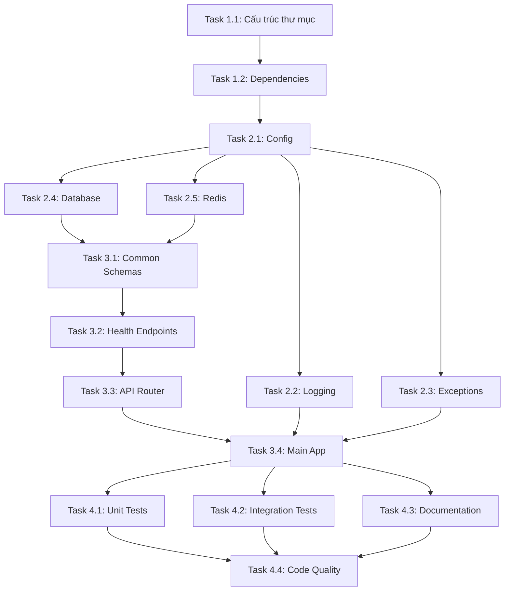

# Lập Kế Hoạch Dự Án & Phân Tích Nhiệm Vụ - Nền Tảng Backend

## Mốc Quan Trọng

**Các điểm kiểm tra chính là gì?**

- [ ] **Milestone 1:** Cấu trúc project, dependencies và Alembic setup (50 phút)
- [ ] **Milestone 2:** Core layer hoàn chỉnh (Config, Database, Redis, Middleware, Exceptions, Logging) (2.5 giờ)
- [ ] **Milestone 3:** API layer và health check endpoints (1 giờ 10 phút)
- [ ] **Milestone 4:** Testing và documentation (1 giờ 20 phút)

**Tổng thời gian ước tính:** 5.5 giờ

## Phân Tích Nhiệm Vụ

**Công việc cụ thể nào cần thực hiện?**

### Giai Đoạn 1: Setup Project Structure

**Mục tiêu:** Tạo cấu trúc thư mục và cài đặt dependencies

- [ ] **Task 1.1:** Tạo cấu trúc thư mục backend

  - Tạo `backend/` directory
  - Tạo `backend/app/` với `__init__.py`
  - Tạo các thư mục: `core/`, `common/`, `api/`, `redis/`, `modules/`
  - Tạo `__init__.py` cho mỗi package
  - **Thời gian:** 10 phút

- [ ] **Task 1.2:** Setup dependencies và environment

  - Tạo `requirements.txt` với dependencies cần thiết
  - Tạo `.env.example` với environment variables template và comments
  - Tạo `.gitignore` cho Python project (bao gồm `.env`, `venv/`, `__pycache__/`)
  - Tạo `README.md` với hướng dẫn setup chi tiết
  - **Thời gian:** 25 phút
  - **Dependencies:**
    ```
    fastapi>=0.109.0
    uvicorn[standard]>=0.27.0
    pydantic>=2.5.0
    pydantic-settings>=2.1.0
    python-dotenv>=1.0.0
    sqlmodel>=0.0.14
    asyncpg>=0.29.0
    redis>=5.0.0
    python-multipart>=0.0.6
    tenacity>=8.2.0
    python-json-logger>=2.0.0
    alembic>=1.13.0
    ```

- [ ] **Task 1.3:** Setup Alembic infrastructure
  - Initialize Alembic với `alembic init alembic`
  - Configure `alembic.ini` với SQLModel metadata
  - Setup `alembic/env.py` với async engine
  - Tạo README trong alembic/ folder
  - **Thời gian:** 15 phút

### Giai Đoạn 2: Core Layer Implementation

**Mục tiêu:** Implement các module core (config, database, redis, exceptions, logging)

- [ ] **Task 2.1:** Configuration Management (`app/core/config.py`)

  - Create `Settings` class với Pydantic BaseSettings
  - Define tất cả environment variables (bao gồm security vars)
  - Add field validators cho DATABASE_URL, CORS_ORIGINS
  - Implement `cors_origins_list` property
  - **Thời gian:** 25 phút
  - **Output:** Settings object có thể import và sử dụng

- [ ] **Task 2.2:** Logging Setup (`app/core/logging.py`)

  - Create `JSONFormatter` class cho structured logging
  - Configure logging cho development vs production
  - Setup log levels theo environment
  - Request ID propagation trong logs
  - **Thời gian:** 20 phút

- [ ] **Task 2.3:** Exception Handling (`app/core/exceptions.py`)

  - Define `ErrorCode` enum với tất cả error codes
  - Create custom exception classes (ZenSpaException, DatabaseException, etc.)
  - Create exception handlers cho FastAPI
  - Standardize error response format với request_id
  - **Thời gian:** 30 phút

- [ ] **Task 2.4:** Database Layer (`app/core/database.py`)

  - Create async SQLAlchemy engine với retry mechanism (tenacity)
  - Setup connection pool với proper config
  - Implement `get_async_session()` context manager dependency
  - Implement `check_database_health()` function
  - Implement `init_db()` với retry và `close_db()` for lifecycle
  - **Thời gian:** 35 phút
  - **Test:** Connection thành công với Supabase

- [ ] **Task 2.5:** Redis Layer (`app/redis/client.py`, `app/redis/helpers.py`)

  - Create Redis connection với async support
  - Implement connection pool và graceful fallback
  - Implement `check_redis_health()` function
  - Implement cache helpers (get, set, delete) với fallback
  - **Thời gian:** 30 phút
  - **Test:** Connection thành công với Redis, fallback hoạt động

- [ ] **Task 2.6:** Middleware (`app/core/middleware.py`)
  - Implement `SecurityHeadersMiddleware` (HSTS, X-Frame-Options, etc.)
  - Implement `RequestIDMiddleware` (generate UUID, add to headers)
  - **Thời gian:** 20 phút

### Giai Đoạn 3: API Layer & Main Application

**Mục tiêu:** Tạo FastAPI app và health check endpoints

- [ ] **Task 3.1:** Common Schemas (`app/common/schemas.py`)

  - Define `HealthCheckResponse` schema
  - Define `DatabaseHealthResponse` schema
  - Define `RedisHealthResponse` schema
  - Define `ErrorResponse` và `ErrorDetail` schemas
  - Define common response wrappers
  - **Thời gian:** 20 phút

- [ ] **Task 3.2:** Health Check Endpoints (`app/api/health.py`)

  - Implement `GET /health` endpoint
  - Implement `GET /health/db` endpoint với response time measurement
  - Implement `GET /health/redis` endpoint với response time measurement
  - Handle 200 vs 503 status codes correctly
  - **Thời gian:** 30 phút
  - **Test:** Tất cả endpoints trả về correct response

- [ ] **Task 3.3:** API Router (`app/api/api_v1.py`)

  - Create APIRouter với prefix `/api/v1`
  - Include health check router
  - Document versioning strategy
  - **Thời gian:** 10 phút

- [ ] **Task 3.4:** Main Application (`app/main.py`)
  - Create FastAPI instance với metadata
  - Add all middlewares (Security, RequestID, CORS) đúng thứ tự
  - Register exception handlers (ZenSpa, Validation, General)
  - Mount API router
  - Implement lifespan context manager (init DB, Redis)
  - Implement shutdown cleanup (close connections)
  - **Thời gian:** 30 phút
  - **Test:** App khởi động thành công, middlewares hoạt động

### Giai Đoạn 4: Testing & Documentation

**Mục tiêu:** Viết tests và hoàn thiện documentation

- [ ] **Task 4.1:** Unit Tests

  - Test config loading và validation
  - Test database health check
  - Test Redis health check
  - Test exception handlers
  - **Thời gian:** 30 phút
  - **Coverage target:** 80%+

- [ ] **Task 4.2:** Integration Tests

  - Test `/health` endpoint
  - Test `/health/db` endpoint
  - Test `/health/redis` endpoint
  - Test CORS configuration
  - **Thời gian:** 20 phút

- [ ] **Task 4.3:** Documentation

  - Complete `README.md` với setup instructions
  - Document environment variables trong `.env.example`
  - Add comments trong code cho phần phức tạp
  - Verify Swagger docs hiển thị đúng
  - **Thời gian:** 15 phút

- [ ] **Task 4.4:** Code Quality
  - Run black formatter
  - Run ruff linter
  - Fix tất cả warnings
  - Type check với mypy (nếu có)
  - **Thời gian:** 15 phút

## Phụ Thuộc

**Điều gì cần xảy ra theo thứ tự nào?**

### Task Dependencies



### External Dependencies

- **Supabase Project:** Cần có project URL và credentials
- **Redis Server:** Cần có Redis running (local hoặc cloud)
- **Python 3.12+:** Installed và configured
- **Git:** Để version control

### Blocking Issues

- ❌ Không có Supabase credentials → Không test được database connection
- ❌ Redis không chạy → Health check sẽ fail (nhưng app vẫn chạy)

## Thời Gian & Ước Tính

**Khi nào mọi thứ sẽ hoàn thành?**

### Breakdown theo Phase

| Phase                | Tasks    | Thời gian     | Phụ thuộc |
| -------------------- | -------- | ------------- | --------- |
| **Phase 1: Setup**   | 1.1, 1.2 | 30 phút       | Không     |
| **Phase 2: Core**    | 2.1-2.5  | 1.5 giờ       | Phase 1   |
| **Phase 3: API**     | 3.1-3.4  | 1 giờ 20 phút | Phase 2   |
| **Phase 4: Testing** | 4.1-4.4  | 1 giờ 20 phút | Phase 3   |

### Timeline Estimate

**Nếu làm tuần tự:**

- Day 1 Morning (2h): Phase 1 + Phase 2
- Day 1 Afternoon (2h): Phase 3 + Phase 4

**Nếu có blocking issues:**

- Add 30 phút buffer cho troubleshooting

### Ngày mục tiêu

- **Start:** Ngay khi được approve
- **Complete:** 1 ngày làm việc (4 giờ pure coding)

## Rủi Ro & Giảm Thiểu

**Điều gì có thể sai sót?**

### Rủi Ro Kỹ Thuật

| Rủi ro                        | Mức độ     | Impact     | Giảm thiểu                                     |
| ----------------------------- | ---------- | ---------- | ---------------------------------------------- |
| Supabase connection fail      | Cao        | Cao        | Test connection trước, có retry mechanism      |
| Redis không available         | Trung bình | Thấp       | App vẫn chạy, log warning, fallback gracefully |
| Dependencies conflict         | Thấp       | Trung bình | Pin versions trong requirements.txt            |
| Async/await bugs              | Trung bình | Trung bình | Careful code review, testing                   |
| Environment variables missing | Cao        | Cao        | Validate khi startup, clear error messages     |

### Rủi Ro Nguồn Lực

| Rủi ro                        | Mức độ | Impact     | Giảm thiểu                          |
| ----------------------------- | ------ | ---------- | ----------------------------------- |
| Không có Supabase credentials | Cao    | Cao        | Request credentials trước khi start |
| Redis setup phức tạp          | Thấp   | Thấp       | Dùng Docker hoặc Redis Cloud        |
| Python version mismatch       | Thấp   | Trung bình | Document Python version requirement |

### Rủi Ro Phụ Thuộc

| Rủi ro                | Mức độ | Impact     | Giảm thiểu                           |
| --------------------- | ------ | ---------- | ------------------------------------ |
| Supabase service down | Thấp   | Cao        | Không thể giảm thiểu, monitor status |
| Package deprecated    | Thấp   | Trung bình | Dùng stable versions                 |

### Chiến Lược Giảm Thiểu Tổng Quát

1. **Validate early:** Check Supabase + Redis connection ngay trong Task 2.4, 2.5
2. **Graceful degradation:** App vẫn start khi Redis down
3. **Clear errors:** Exception messages rõ ràng để debug
4. **Incremental testing:** Test sau mỗi task hoàn thành
5. **Documentation:** Document mọi setup steps

## Tài Nguyên Cần Thiết

**Chúng ta cần gì để thành công?**

### Team & Roles

- **Backend Developer:** 1 người (implement core features)
- **Reviewer:** 1 người (code review sau khi done)

### Tools & Services

- **IDE:** VS Code với Python extension
- **Database:** Supabase PostgreSQL (cloud)
- **Cache:** Redis (local Docker hoặc Redis Cloud)
- **Testing:** Pytest, Pytest-asyncio
- **Linting:** Black, Ruff, isort
- **API Testing:** Thunder Client / Postman / curl

### Infrastructure

- **Development:**

  - Python 3.12+ environment
  - Virtual environment (venv)
  - Git repository
  - Local Redis (Docker: `docker run -d -p 6379:6379 redis`)

- **External Services:**
  - Supabase project (đã có)
  - Redis server (setup local hoặc cloud)

### Documentation & Knowledge

- **FastAPI docs:** https://fastapi.tiangolo.com/
- **SQLModel docs:** https://sqlmodel.tiangolo.com/
- **Supabase docs:** https://supabase.com/docs
- **Redis Python docs:** https://redis-py.readthedocs.io/
- **Pydantic Settings:** https://docs.pydantic.dev/latest/concepts/pydantic_settings/

### Required Access

- ✅ Supabase project URL và anon key
- ✅ Supabase service role key (cho backend)
- ✅ Redis connection string (nếu dùng cloud)
- ✅ Git repository access

## Implementation Order (Recommended)

**Thứ tự thực hiện tối ưu:**

1. ✅ **Start:** Task 1.1, 1.2 (Setup structure)
2. ✅ **Then:** Task 2.1 (Config) - Foundation cho tất cả
3. ✅ **Then:** Task 2.2, 2.3 (Logging, Exceptions)
4. ✅ **Then:** Task 2.4, 2.5 (Database, Redis) - Có thể parallel
5. ✅ **Then:** Task 3.1 (Schemas)
6. ✅ **Then:** Task 3.2 (Health endpoints)
7. ✅ **Then:** Task 3.3, 3.4 (Router, Main app)
8. ✅ **Then:** Task 4.1, 4.2 (Tests)
9. ✅ **Finally:** Task 4.3, 4.4 (Docs, Quality)

**Checkpoint sau mỗi phase để verify everything works!**
